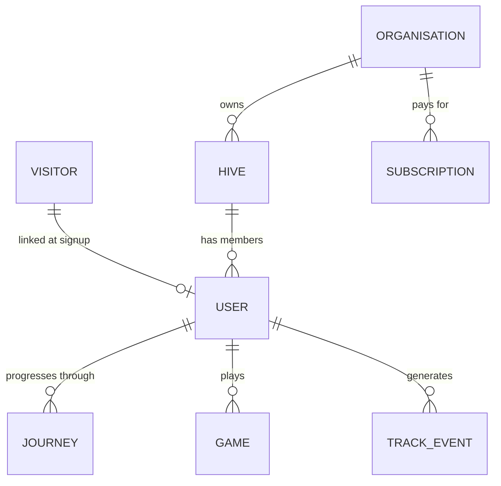

# Education App Database Schema — `school_hive` (`number-hive-complete`)

**Status:** First pass at documenting this database's actual entity structure. Nobody had
previously written down collection/field-level detail anywhere in this repo — `platform-overview.md`
and `system-overview.md` mention `Visitor`, `User`, `TrackEvent`, and a `Session` model plus
"hives, journeys, gameplay" data at a high level; this document is the full breakdown behind
that summary, cited directly to the model source files. Everything below was read directly from
`number-hive-complete/backend/src/database/models/` on 2026-08-28 — treat this as a snapshot,
not a live-synced reference; re-check against the source if consulted much later.

**ODM:** [`@typegoose/typegoose`](https://typegoose.github.io/typegoose/) (v9) over Mongoose 6
(`backend/package.json`) — classes decorated with `@prop`/`@Prop`/`@Index`/`@modelOptions`,
compiled to Mongoose schemas via `getModelForClass()`. Not raw Mongoose schema files, which is
why an earlier `**/*.model.ts` glob found nothing — every model lives in
`backend/src/database/models/*.ts`, one class per file, named for the collection it backs (e.g.
`visitor.ts` → `Visitor`/`visitors`). All models extend a shared `BaseModel`
(`backend/src/database/models/base.ts`) contributing `_id` (`ObjectId`), a virtual string `id`,
and (when `timestamps: true` is set in `@modelOptions`, which almost every model here does)
`createdAt`/`updatedAt`.

**Database name:** informally `school_hive` per `architecture/platform-overview.md` and
`architecture/system-overview.md` — the actual name comes from the connection string
(`config.database.mongodb.url`, read in `backend/src/database/connect.ts`), which is
environment-specific and not itself checked into the repo; this document doesn't re-derive it,
it only confirms the connection is a single Mongoose connection shared by every model below (no
sharding/multi-DB split visible in the model layer).

**Foreign keys are strings, not native ObjectId refs.** Typegoose's `@Prop({ ref: () => X, type:
() => String })` pattern is used throughout (e.g. `Hive.ownerId`, `Journey.userId`) — the "ref"
metadata lets Typegoose's `.populate()` work, but the field itself is declared and stored as a
`String` (matching `BaseModel.id`, the virtual string form of `_id`), not a native `ObjectId`.
This is a deliberate, consistent convention across every relationship in this database, not a
one-off — worth knowing if you're writing raw aggregation pipelines, since a naive `$lookup`
matching `ObjectId` to `String` will silently return nothing.

---

## 1. Entity-relationship diagram — core product domain

This diagram covers the entities that make up the actual product (identity, hives/subscriptions,
journeys/gameplay, and first-party attribution/analytics). It omits the admin/internal-tooling
collections (Analyser query builder, dashboards, audit logs) — those are listed separately in
§4, since they're operational/BI tooling rather than product domain data and would clutter this
diagram without adding architectural insight. Field lists below are the significant/identifying
fields only, not exhaustive — see §2–§3's full tables for everything.

Before the full diagram, here's the same domain stripped down to the handful of entities that
matter for orienting yourself — a school (`ORGANISATION`) buys a `SUBSCRIPTION`, its `HIVE`s
(classes) contain `USER`s, and those users generate `JOURNEY` (learning) and `GAME` (gameplay)
activity, all captured to `TRACK_EVENT` for analytics. Every box here explodes into more detail
(and more entities) in the full diagram below — this is the map, not the territory:

The full picture, with every entity, relationship, and field-level detail:

```mermaid
erDiagram
    VISITOR ||--o| USER : "linked at signup (userId, app-level — no Mongoose ref)"
    USER ||--o{ SESSION : "has (Session.userId — no ref)"
    USER ||--o{ HIVE : "owns (Hive.ownerId, ref)"
    USER ||--o{ HIVE_USER_RELATION : "is member via (userId, ref)"
    HIVE ||--o{ HIVE_USER_RELATION : "has members (hiveId, ref)"
    USER ||--o{ JOURNEY : "has (userId, ref)"
    USER ||--o{ JOURNEY_GAME_BADGES : "has (userId, ref)"
    USER ||--o{ USER_STREAK_HISTORY : "has (userId, ref)"
    USER ||--o{ GYM_STATS : "has practice stats (userId, ref)"
    JOURNEY ||--o{ JOURNEY_STAGE_RESULT : "synced from history (journeyId, string — no ref)"
    USER ||--o{ GAME : "plays (Game.users[].id — embedded, no ref)"
    GAME ||--o| GAME_PLAYED : "finished game recorded as (gameId — app-level match, no ref)"
    ORGANISATION ||--o{ SUBSCRIPTION : "billed via (Subscription.orgId — no ref)"
    PRODUCT ||--o{ SUBSCRIPTION : "priced by (Subscription.productId — no ref)"
    SUBSCRIPTION ||--o{ HIVE : "covers (Subscription.hiveIds[] — string array, no ref; Hive.subscriptionId is deprecated)"
    SUBSCRIPTION ||--o{ SUBSCRIPTION_CHARGE : "has charges (subscriptionId — no ref)"
    SUBSCRIPTION ||--o{ SUBSCRIPTION_INVOICE : "has invoices (subscriptionId — no ref)"
    USER ||--o{ TRACK_EVENT : "generates (userId — optional, no ref)"
    VISITOR ||--o{ TRACK_EVENT : "generates (visitorId — optional, no ref)"

    VISITOR {
        string visitorId UK
        Date firstSeenAt
        Date lastSeenAt
        string userId "set once linked"
        string utmSource
        string country
    }
    USER {
        string email UK
        string displayName
        string userType "USER or TEACHER"
        boolean isAdmin
        number points
        string stripeCustomerId
        string acquisitionVisitorId
    }
    SESSION {
        string sessionId UK
        string userId
        string visitorId
        Date startedAt
        Date lastActiveAt
    }
    HIVE {
        string ownerId FK
        string name
        string size "SingleUser|FamilyHive|ClassHive|SchoolHive"
        string code UK
        number numberOfSeats
        string paymentStatus
    }
    HIVE_USER_RELATION {
        string ownerId FK
        string userId FK
        string hiveId FK
        string code
    }
    JOURNEY {
        string userId FK
        string currentStage
        string gameType
        array history "embedded JourneyHistoryEntry[]"
    }
    JOURNEY_STAGE_RESULT {
        string journeyId "string, not a ref"
        string userId FK
        string stageId
        number score
        Date syncedAt
    }
    JOURNEY_GAME_BADGES {
        string userId FK
        string gameType
        array earnedBadges "embedded EarnedBadge[]"
    }
    GYM_STATS {
        string userId FK
        string gameType
        number played
        number won_or_highScore
    }
    GAME {
        array users "embedded GameUser[] {id, name}"
        string status
        string joinCode UK
        object gameState "embedded GameState"
    }
    GAME_PLAYED {
        string gameId "app-level key, matches Game record"
        array hiveIds
        array players
        string winnerId
        Date startDate
    }
    ORGANISATION {
        string name
        string type "school|district|trust"
        string parentOrgId
    }
    PRODUCT {
        string name
        string billingInterval "month|year"
        number defaultPrice
    }
    SUBSCRIPTION {
        string orgId
        string productId
        array hiveIds
        string stripeSubscriptionId UK
        string status
        Decimal128 unitAmount_USD
    }
    SUBSCRIPTION_CHARGE {
        string subscriptionId
        Decimal128 amount_USD
        Date periodStart
    }
    SUBSCRIPTION_INVOICE {
        string subscriptionId
        string stripeInvoiceId UK
        string status
        Decimal128 amountDue_USD
    }
    TRACK_EVENT {
        string sessionId
        string area
        string action
        string visitorId
        string userId
        string hiveId
    }
```

**Reading the diagram's relationship labels:** every edge above is annotated with whether it's a
Typegoose `ref` (declared with `@Prop({ ref: () => X })`, enabling `.populate()`) or a plain
string field that happens to line up with another collection's key by application convention
only (no `ref`, no enforced integrity, no `.populate()` support). Most of the core identity/hive
relationships (`Hive.ownerId`, `HiveUserRelation.*`, `Journey.userId`, `JourneyGameBadges.userId`,
gym-stats `userId`, push-token `userId`) **are** declared `ref`s. Several higher-traffic
relationships are **not** — `Session.userId`, `TrackEvent.userId`/`visitorId`, `Visitor.userId`,
`Subscription.orgId`/`productId`/`hiveIds`, and `SubscriptionCharge`/`SubscriptionInvoice`'s
`subscriptionId` are all plain `@Prop({ required: true })` strings with no `ref` metadata — likely
because these are either high-volume analytics collections (a `ref` adds no runtime value there)
or because the billing/admin layer was built to mirror Stripe data by ID rather than to be
`.populate()`-traversed. This is read directly from each model file (cited below), not inferred.

---

## 2. Core product entities

### 2.1 Identity & session

| Collection | Model file | Key fields | Notes |
|---|---|---|---|
| `visitors` | `backend/src/database/models/visitor.ts` | `visitorId` (unique), `firstSeenAt`, `lastSeenAt`, `country`, first-touch UTM fields (`utmSource/Medium/Campaign/Content/Term`, `referrer`, `landingPage` — write-once), `userId`/`linkedAt`/`linkedVia` (set when linked to a `User`), device-fingerprint fields (`screenW/H`, `devicePixelRatio`, `touchCapable`, `platform`, `connectionType`) | This is the `Visitor` collection cited in `platform-overview.md` §3 as backing the `nh_vid` cross-session identity and the `POST /api/visitor/identify`/`link` endpoints. `userId` is a plain string, **not** a Typegoose `ref` — the visitor→user link is an application-level pointer, not a Mongoose relation. |
| `users` (default Mongoose pluralisation — no explicit `collection` override in `@modelOptions`) | `backend/src/database/models/user.ts` | `email` (unique, lower-cased on write), `firstName`/`lastName`/`displayName`, `roles` (enum, currently only `AUTHENTICATED`), `userType` (`USER` \| `TEACHER` — `backend/src/constants/user-type.ts`), `passwordHash`/`salt` or `googleId`/`appleId`, `registration` (embedded `{apple, google, email}` flags), `stripeCustomerId`, `isAdmin`, `points`, activation-milestone timestamps (`firstHiveCreatedAt`, `firstStudentAddedAt`, `firstGamePlayedAt`), geo (`country`/`region`, from Cloudflare `CF-IPCountry`), and a full mirrored set of `acquisitionUtm*`/`acquisitionReferrer`/`acquisitionLandingPage`/`acquisitionVisitorId`/`acquisitionLinkedVia` fields set once at signup from the linked `Visitor` | This is the `User` collection cited in `platform-overview.md`/`system-overview.md`. Note the acquisition fields duplicate the visitor's first-touch attribution onto the user record itself at signup (`acquisitionVisitorId` links back to `Visitor.visitorId`) rather than relying on a live join — both a `Visitor` doc and its "frozen copy" on the linking `User` doc can exist simultaneously. |
| `sessions` | `backend/src/database/models/session.ts` | `sessionId` (unique), `userId` (string, **no ref**), `visitorId` (optional), `userType`, `startedAt`, `lastActiveAt`, `country`, `userAgent` | This is the `Session` model referenced in `system-overview.md`'s "hives, journeys, gameplay" summary and `subdomain-map.md` §3a's event-tracking design note (`2026-05-17-main-app-event-tracking-design.md`, in `number-hive-complete`, not re-read directly for this document — cited here only via that design's already-documented existence). |
| `tokenPairs` (default pluralisation) | `backend/src/database/models/tokenPair.ts` | `userId`, `accessToken`, `refreshToken`, `expiresAtMs`, `isImpersonation` | Access/refresh token pairs — created on login, deleted on logout. Not linked via `ref`. |
| `codes` (default pluralisation) | `backend/src/database/models/code.ts` | `email`, `code`, `expiresAtMs`, `type` (`CodeType` enum) | One-time verification codes (e.g. email verification / password reset) — exact `CodeType` values live in `backend/src/constants/code-type.ts` (not re-read for this document). |
| `randomcodes` | `backend/src/database/models/random-code.ts` | `prefix` (unique), `sequence` | Not a `BaseModel` subclass (no `_id`/timestamps convention beyond `timestamps: true`) — a small sequence-allocation table for a prefix-based code scheme, likely feeding hive join codes. |
| `counters` | `backend/src/database/models/counter.ts` | `name` (unique), `seq` | Generic atomic-increment counter (`findOneAndUpdate` + `$inc`) — currently used at least for dashboard-widget ordering per its own comment. System/infrastructure table, not product data. |
| `pushtokens` | `backend/src/database/models/push-token.ts` | `userId` (ref → `User`), `token` | Device push-notification tokens. |

### 2.2 Hives, membership, and journeys

| Collection | Model file | Key fields | Notes |
|---|---|---|---|
| `hives` (default pluralisation) | `backend/src/database/models/hive.ts` | `ownerId` (ref → `User`), `name`, `size` (`HiveSize`: `SingleUser`\|`FamilyHive`\|`ClassHive`\|`SchoolHive`), `subscriptionType` (`month`\|`year`), `code` (unique — student join code), `numberOfSeats`/`seatTaken`, `subscriptionId` (**deprecated** — comment in source explicitly says use `Subscription.hiveIds` instead), `paymentStatus` (`NotPaid`\|`Pending`\|`Active`\|`Canceled`\|`PaymentFailed`), `allowedHiveGames` | The "class"/"family"/"school" grouping entity. Its `subscriptionId` field is a deprecated leftover — the model file's own comment says `Subscription` is now the owning side of the hive↔subscription relationship via `Subscription.hiveIds`, kept only for backward compatibility with existing documents. |
| `hiveUserRelations` | `backend/src/database/models/hive-user.ts` | `ownerId` (ref → `User`), `userId` (ref → `User`), `hiveId` (ref → `Hive`), `code`, `allowedHiveGames` | Join table for hive membership — unique compound index on `{ownerId, userId, hiveId}`. |
| `journeys` (default pluralisation) | `backend/src/database/models/journey.ts` | `userId` (ref → `User`), `currentStage` (`EStageId` enum), `gameType` (`GameType` enum, shared with `Game`), `completedAt`, `history` (embedded `JourneyHistoryEntry[]`: `stageId`, `type`, `completedAt`, `details` — `Mixed`) | Per-user learning-journey progress through a curriculum's staged sequence. |
| `journeystageresults` (default pluralisation) | `backend/src/database/models/journey-stage-result.ts` | `journeyId` (plain string — **not** a Typegoose ref, despite the name), `userId` (ref → `User`), `gameType`, `stageId`, `stageType` (`Assessment`\|`Survey`\|`Level`, per `EStageType`), assessment fields (`score`, `averageTimePerAnswer`), survey fields (`confidence`, `selfEfficacy`, `attitude`, `growthMindsetEffort/Ability`, `reasoningProcess/Persistence`), level fields (`bossDone`), `syncedAt` | A denormalised/synced projection of `Journey.history` entries into their own queryable collection — the source comment explains this exists specifically for Analyser-style pivots by `stageId`/`stageType` that would be awkward against `Journey`'s embedded array. Unique compound index on `{journeyId, stageId}`; nullable fields are stored **absent**, not `null`, by design (source comment: use `$exists` in queries, not `$ne: null`). |
| `journeygamebadges` (default pluralisation) | `backend/src/database/models/journey-game-badges.ts` | `userId` (ref → `User`), `gameType`, `earnedBadges` (embedded `EarnedBadge[]`: `type`, `value`, `earnedAt`) | |
| `userstreakhistories` (default pluralisation) | `backend/src/database/models/user-streak-history.ts` | `userId` (ref → `User`), `currentStreak`, `longestStreak`, `lastUpdatedAt`, `history` (embedded `StreakHistory[]`: `streakCount`, `earnedAt`, `seen`) | Daily-play-streak tracking, separate from the journey/game-badge system. |
| `globallobbies` (default pluralisation) | `backend/src/database/models/global-lobby.ts` | `userId` (unique), `gameType` (unique — i.e. one lobby-presence doc per `{userId, gameType}` pair via the two independent unique constraints), `userName`, `isOnline` | Real-time matchmaking-lobby presence, one doc per user per game type. |

### 2.3 Gameplay

| Collection | Model file | Key fields | Notes |
|---|---|---|---|
| `games` (default pluralisation) | `backend/src/database/models/game.ts` | `users` (embedded `GameUser[]`: `id`, `name`, `isOnline` — **not** a `ref` array, a fully embedded subdocument list), `status` (`PENDING`\|`IN_PROGRESS`\|`FINISHED`\|`UNATTENDED`\|`LEFT_UNFINISHED`), `lastActivityAt`, `joinCode` (unique, sparse), `gameState` (embedded `GameState`: `gameType`, `tiles` (`HiveTile[]`), `lookup`, `turn`, `winningPlayerId`, `leftOperand`/`rightOperand` (embedded `Operand`), `lastPlayedTimeAt`), `AIDifficultyLevel` | Live/in-progress multiplayer game state — the actual "hive" board game (tile-claiming, numeric operand strips) this product is built around. `gameType` enum (`MULTI_1_12`, `ADD_ALGEBRA`, `DIVIDE`, etc. — full list in `game.ts`) is the shared vocabulary used across `Journey`, `JourneyStageResult`, `JourneyGameBadges`, and the three `Gym*PracticeGames` collections below. |
| `gamePlayed` (explicit `collection` override not set — default pluralisation of `GamePlayed`, i.e. `gameplayeds`; **inferred**, not directly confirmed in source, since `analytics/game-played.ts` has no explicit `collection:` string in its `@modelOptions`) | `backend/src/database/models/analytics/game-played.ts` | `gameId` (unique — dedup key against a `Game` record, plain string, no `ref`), `hiveIds`/`hiveOwnerIds`/`players` (string arrays — each independently indexed since Mongo disallows a compound multikey index across two array fields), `gameType`, `winnerId`, `startDate`/`endDate`, `durationInMs` | A permanent post-game analytics record, written once per finished game — distinct from the live, mutable `Game`/`games` collection. Source comments flag this explicitly as feeding Analyser pivots by game type/player/hive over time. **Flagging uncertainty:** the actual collection name is Mongoose's default pluralisation of the class name (`GamePlayed` → typically `gameplayeds`) since no `collection:` override was found in this file — not independently verified against a live database, only inferred from the absence of an explicit override (contrast with `visitors`/`sessions`/`trackEvents`/`demoLeads`/etc., which do set one explicitly). |
| `gymaipracticegames` (default pluralisation) | `backend/src/database/models/gym-ai-practice-games.ts` | `userId` (ref → `User`), `gameType`, `aiDifficultyLevel`, `played`, `won` | Practice-mode stats vs. AI, one doc per `{userId, gameType, aiDifficultyLevel}`. |
| `gymassessmentpracticegames` (default pluralisation) | `backend/src/database/models/gym-assessment-practice-games.ts` | `userId` (ref → `User`), `gameType`, `assessmentMode` (`EGymAssessmentMode`), `played`, `highScore`, `correctCount`, `questionsTaken`, `timeSec`, `correctAnswers`/`wrongAnswers` (embedded `Answer[][]`, each `Answer` = `{left: Operand, right: Operand}`) | Timed assessment-mode practice stats, including full logged correct/wrong answer history. |
| `gymplayfriendgames` (default pluralisation) | `backend/src/database/models/gym-play-friend-games.ts` | `userId` (ref → `User`), `gameType`, `opponentName`, `played`, `won` | Head-to-head "play a friend" practice stats, keyed by opponent display name (not a `User` ref) rather than opponent user ID. |

**Uncertain/inferred:** the three `Gym*PracticeGames` and `GamePlayed` collections all import `Hive` (`import { Hive } from './hive'`) but none of their `@Prop` fields actually reference a `Hive` document — the import appears unused for a direct relationship in the fields I read; not investigated further, since it doesn't change the documented schema, only flagged in case it's dead code or a relationship implemented elsewhere (e.g. a service-layer join) that isn't visible at the model-definition level.

### 2.4 Organisations, products, subscriptions, billing

| Collection | Model file | Key fields | Notes |
|---|---|---|---|
| `organisations` (default pluralisation) | `backend/src/database/models/organisation.ts` | `name`, `type` (`school`\|`district`\|`trust`), `parentOrgId` (self-referential string, no `ref`), `contactName/Email/Phone`, `notes` | |
| `products` (default pluralisation) | `backend/src/database/models/product.ts` | `name`, `stripeProductId`, `billingInterval` (`month`\|`year`), `defaultPrice`, `active` | Billing product catalog. |
| `subscriptions` (default pluralisation) | `backend/src/database/models/subscription.ts` | `orgId`, `productId`, `hiveIds` (string array — the owning side of the hive↔subscription relationship per `hive.ts`'s own deprecation comment), `stripeSubscriptionId` (unique, sparse), `stripeCustomerId`, `committed`, `paymentChannel` (`stripe`\|`external`\|`none`), `status` (`active`\|`trialing`\|`canceled`\|`past_due`\|`incomplete`\|`free`), `startDate`/`endDate`, `seats`, Stripe-enrichment fields (`currentPeriodStart/End`, `cancelAtPeriodEnd`, `canceledAt`, `coupon`, `interval`, `quantity`, `currency`), monetary fields stored as `Decimal128` in USD (`lastInvoiceAmount_USD`, `nextInvoiceAmount_USD`, `unitAmount_USD`), `discountData` (embedded `DiscountData`: `couponId`, `duration`, `percentOff` or `amountOff_USD`, `discountStart/End`) | The billing/subscription entity referenced generically in `system-overview.md`'s data-ownership table (as data still living in `number-hive-complete` pending the planned `number-hive-admin` migration per ADR-005) — this is the concrete schema behind that summary. Monetary amounts were migrated to `Decimal128` USD (CHG-2400, per inline comments) rather than floats, presumably for exact-currency-arithmetic reasons. |
| `subscriptioncharges` (default pluralisation) | `backend/src/database/models/subscription-charge.ts` | `subscriptionId` (string, no ref), `date`, `amount_USD` (`Decimal128`, negative for refunds), `currency`, `periodStart/End`, `invoiceId` (FK to `SubscriptionInvoice._id`, string, no ref), `source` (`stripe`\|`manual`), `type` (`charge`\|`refund`), `stripeChargeId`/`refundRef` (sparse upsert keys) | Individual charge/refund ledger lines. |
| `subscriptioninvoices` (**explicit `collection` not confirmed** — inferred default pluralisation; not directly re-checked) | `backend/src/database/models/subscription-invoice.ts` | `subscriptionId`, `stripeInvoiceId` (unique — primary upsert key), `stripeSubscriptionId`, `status` (`draft`\|`open`\|`paid`\|`void`\|`uncollectible`), `amountDue_USD`/`amountPaid_USD`/`amountRemaining_USD` (`Decimal128`), `currency`, `invoiceDate`, `dueDate`, `periodStart/End` | Described in its own header comment as "a lean mirror of Stripe Invoice for AR tracking." |
| `stripecoupons` (default pluralisation; not independently confirmed) | `backend/src/database/models/stripe-coupon.ts` | `couponId` (unique), `name`, `percentOff` or `amountOff_USD` (`Decimal128`), `currency`, `duration` (`forever`\|`once`\|`repeating`), `durationInMonths`, `redeemBy`, `created`, `syncedAt` | Reference-only mirror of Stripe coupon metadata for audit/reporting — the projection/revenue-modelling engine reads `discountData` embedded directly on `Subscription` at runtime, not this collection, per the file's own header comment. |
| `subscriptionAuditResult` | `backend/src/database/models/subscription-audit.ts` | `lastRefreshedAt`, `refreshDurationMs`, per-category counts (`activeMissingCount`, `statusMismatchCount`, `unlinkedCustomerCount`, `missingEnrichmentCount`, `canceledMissingCount`) each paired with an embedded array of detail items (`ActiveMissingItem[]`, `StatusMismatchItem[]`, `UnlinkedCustomerItem[]`, `MissingEnrichmentItem[]`) | Snapshot output of a Stripe↔`Subscription` reconciliation audit job — a single evolving/rewritten-per-run report doc, not a per-subscription table. |

### 2.5 Attribution & analytics events

| Collection | Model file | Key fields | Notes |
|---|---|---|---|
| `trackEvents` | `backend/src/database/models/analytics/track-event.ts` | `sessionId`, `area`, `category`, `action`, `label`/`value`, `metadata` (`Object`/`Mixed`), `ip`, `userAgent`, attribution fields (`visitorId`, `userId`, full `utm*`/`referrer`/`landingPage` set, `country`), `hiveId`, device-context (`viewportW/H`) | This is the `TrackEvent` collection named in `platform-overview.md`/`system-overview.md`. General-purpose frontend/backend event log — `area`/`category`/`action`/`label` is a GA-style taxonomy; `metadata` carries anything event-specific. Both `userId` and `visitorId` are optional plain strings (no `ref`), so a single event may carry either, both, or neither depending on auth state at fire time. |
| `demoLeads` | `backend/src/database/models/demo-lead.ts` | `email` (unique), `pathway`, `studentName`, `source` (`teacher`\|`leader`), `sendUpdates`, `userAgent`/`ip`, attribution fields (`visitorId`, `utm*`, `referrer`, `country`), `mailchimpSyncedAt`/`mailchimpSyncError` | Marketing-site/demo-request lead capture — the same collection cited in `docs/conventions/cross-repo-data-push.md` as the UI-shape precedent ("Demo Leads screen") for the still-unbuilt free-game feedback-triage flow. |

---

## 3. Admin, audit, and Analyser (internal-tooling) collections

Deliberately excluded from §1's diagram: these support the internal admin dashboard/"Analyser"
natural-language query builder rather than the education-app product domain itself, and adding
them to the diagram would obscure the product-domain relationships without adding architectural
insight. All confirmed present as separate model files, `backend/src/database/models/` unless
noted.

| Collection | Model file | Purpose |
|---|---|---|
| `adminEventLog` | `admin-event-log.ts` | Admin action audit trail — `eventType`, `actorUserId`, `targetId`, `meta` (`Mixed`). TTL: 180 days. |
| `impersonationlogs` | `impersonation-log.ts` | Records admin "log in as this user" sessions — `adminId`, `targetUserId`, `startedAt`/`exitedAt`. TTL: 90 days. |
| `digestPreferences` | `digest-preference.ts` | Per-admin opt-in settings for a scheduled AI-generated metrics digest email — `adminUserId` (unique), `enabled`, `deliveryHour`, `dashboardIds` (array of `Dashboard` `ObjectId`s — the one place in this database an `ObjectId` array, not a string, is used for a relationship). |
| `dashboards` | `dashboard.ts` | Named, orderable collections of widget/heading placements (`placements[]`, each with `colSpan`/`heightSize` sizing) shown on the admin dashboard UI. |
| `dashboardwidgets` (default pluralisation) | `dashboard-widget.ts` | Individual chart/table/text widgets — stores both the widget's query/chart configuration and a cached last-fetched result snapshot (`DashboardWidgetCachedResult`) so the dashboard can render without re-executing every load. Large file with many embedded sub-schemas (chart field metadata, column definitions, filters, sort state) — not fully enumerated here. |
| `widgetRefreshLog` | `widget-refresh-log.ts` | Log of widget cache-refresh executions — includes embedded per-step timing (`StepTimingDoc[]`, shared with `stats-query-audit-log.ts` via `shared/step-timing.ts`) and a trigger reason (`manual`\|`scheduled`\|`stale`\|`initial`). |
| `analyserArtifacts` | `analyser-artifact.ts` | Outputs generated by the natural-language "Analyser" query assistant. |
| `analyserChatSessions` | `analyser-chat-session.ts` | Chat-turn history (`ChatTurn[]`) and pending background analysis tasks (`PendingAnalysisTask[]`) for the Analyser assistant's conversational interface. |
| `prompt_templates` | `prompt-template.ts` | Keyed (`key`, unique) reusable LLM prompt templates feeding the Analyser assistant. |
| `savedQueries` | `saved-query.ts` | User-saved Analyser queries — stores the generated aggregation pipeline (`SavedQueryPipeline`) plus a cached last-results snapshot, mirroring `dashboard-widget.ts`'s caching pattern. |
| `schemaAnnotations` | `schema-annotation.ts` | Human/auto-generated descriptions of database fields/collections, used to ground the Analyser assistant's natural-language-to-query translation. |
| `collectionSummaries` | `collection-summary.ts` | Cached metadata summaries of each collection (also feeding the Analyser assistant). |
| `statsQueryAuditLog` | `stats-query-audit-log.ts` | Audit trail of every query the Analyser assistant generated and ran, including its generated pipeline and cost-warning level. |
| (no persisted collection — in-memory config class) | `projection-config.ts` | Revenue-projection tuning constants (churn rate, growth rate, etc.) — extends `BaseModel` but not confirmed to be backed by a distinct named collection in the portion of the file read; flagged as **uncertain**, not verified against a live database. |

---

## 4. What this document does not cover

- **Exact current collection names for a handful of models** where no `collection:` override
  appears in the file read (`GamePlayed`, `SubscriptionInvoice`, `StripeCoupon`,
  `DashboardWidget`) — Mongoose's default pluralisation was assumed but not verified against a
  live database connection. Flagged individually in the tables above.
- **`backend/dist/src/database/models`** — the compiled-JS mirror of the same source tree exists
  under `dist/`; this document was written entirely from `backend/src/database/models/*.ts`, the
  actual source of truth, not the build output.
- **Full embedded-subdocument field lists** for the largest/most complex models (`dashboard-widget.ts`'s
  chart-metadata subdocuments especially) — summarised at a high level in §3 rather than
  exhaustively enumerated, per this document's stated scope (significant fields and
  relationships, not a full schema dump).
- **GraphQL resolver-layer field derivations** (`backend/src/graphql/admin/`) — confirmed this
  layer reads/writes the same Mongoose models documented above (no separate schema layer exists
  underneath the GraphQL admin billing/subscription resolvers), but the resolver-level shape of
  what's exposed to the admin UI wasn't itself audited field-by-field.

---

*Written 2026-08-28, reading `number-hive-complete/backend/src/database/models/*.ts` directly.
Cross-checked against `architecture/platform-overview.md`, `architecture/system-overview.md`, and
`docs/conventions/cross-repo-data-push.md` for consistency — no contradictions found; this
document is additive detail behind those pages' existing high-level mentions of `Visitor`,
`User`, `TrackEvent`, `Session`, and "hives, journeys, gameplay."*
