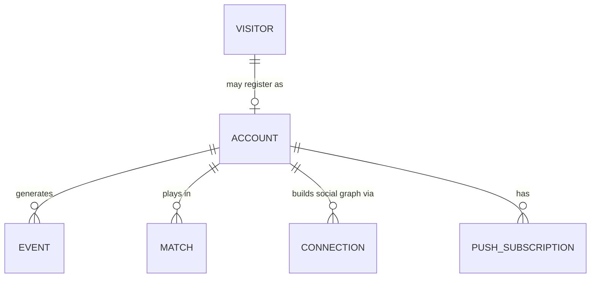

# Free Game Database Schema — `free_game` (`number-hive-newvis`)

**Status:** First pass at documenting this database's actual entity structure. Nobody had
previously written down collection/field-level detail anywhere in this repo — `platform-overview.md`
and `system-overview.md` mention `fg_visitors` keyed by a `clientId` UUID and general "free-game
player/session data" at a high level; this document is the full breakdown behind that summary,
cited directly to the actual route/lib source that reads and writes each collection. Everything
below was read directly from `number-hive-newvis/backend/src/` on 2026-08-28 — treat this as a
snapshot, not a live-synced reference; re-check against the source if consulted much later.

**For document lifecycles, indexes, and the ADR-003 storage contract as it applies to this
database**, see the companion handover document
[`../handover/arcade-data-model.md`](../handover/arcade-data-model.md) — it builds on this
document's entity/field reference rather than repeating it, covering how a match/challenge/
invite/rating moves through its states over time, why each index exists, and which ADR-003
rules have a checkable footprint in these collections.

**No ODM — this is why the earlier model-file search found nothing.** Unlike
`number-hive-complete` (Typegoose over Mongoose — see
[`database-schema-education-app.md`](database-schema-education-app.md)), `number-hive-newvis`'s
backend uses the **raw MongoDB Node.js driver** (`mongodb` ^6.7.0, confirmed in
`backend/package.json` — no `mongoose`/`typegoose` dependency at all). There is no schema
definition layer anywhere: no `*.model.ts`, no Mongoose schemas, no runtime validation beyond
whatever a given route handler checks by hand before calling `db.collection('fg_x').insertOne(...)`.
Every collection shape documented below was reconstructed by reading the actual `insertOne`/
`updateOne`/`findOneAndUpdate` calls across `backend/src/routes/*.js` and `backend/src/lib/*.js` —
there is no single authoritative schema file to cite, only call sites. The nearest thing to an
index of collection *names* is `backend/src/db/indexes.js`, which defines every index (and
therefore every collection) up front at startup; that file is cited throughout as the anchor for
"this collection exists" even where the actual field shape had to be reconstructed from elsewhere.

**Database name:** informally `free_game` per `architecture/platform-overview.md` and
`architecture/system-overview.md`. All collection names are prefixed `fg_` (e.g. `fg_visitors`,
`fg_matches`) — a deliberate namespacing convention for sharing an Atlas project cluster with the
other NumberHive databases, not a Mongo-enforced separation.

**Relationships are entirely by convention, never enforced.** With no ODM there is no `ref`
mechanism at all (contrast with `number-hive-complete`'s explicit ref-vs-no-ref distinction) —
every relationship below is an application-level join on a shared string key, almost always
`clientId` (an anonymous per-browser/device UUID, the free-game analogue of the education app's
`Visitor.visitorId`) or `accountId` (set once a `clientId` registers via Google OAuth), plus
game-specific keys like `matchId`, `challengeId`, or `linkId`. No foreign-key integrity, no
cascade behaviour, no `.populate()`-equivalent exists anywhere in this database.

**This document supersedes `number-hive-newvis/docs/architecture.md` §4.2 for collection shapes.**
That document's own §11 changelog explicitly flags its documented shape for `fg_matches` as
stale/incomplete and is silent on several collections added since (`fg_challenges`,
`fg_pending_games`, `fg_connection_nicknames`, `fg_connection_removals`, `fg_blocks`, `fg_pvp_hiq`,
`fg_hiq_audit` do not appear in it). This document was built by reading the current route/lib
source directly rather than relying on that page, and cites the exact file/line for every field
group below so it can be re-verified.

---

## 1. Entity-relationship diagram — core collections

This diagram covers the collections with meaningful cross-collection relationships. `fg_system_events`
(low-level request/error logging) and `fg_events_push_state` (an internal cursor doc for the
cross-repo events push, already fully documented in
[`docs/conventions/cross-repo-data-push.md`](../docs/conventions/cross-repo-data-push.md)) are
omitted from the diagram and covered only in the table in §2.6. Field lists are the significant/
identifying fields only — see §2's full tables for everything. Every relationship is an
application-level string-key join, not an enforced reference; ref-style diagram notation is used
here loosely, to mean "joined by matching string value," not "declared foreign key."

Before the full diagram, here's the same domain stripped down to the handful of collections
that matter for orienting yourself — an anonymous `VISITOR` may register as an `ACCOUNT`, which
generates `EVENT`s, plays in `MATCH`es, builds a social graph via `CONNECTION`s, and can hold a
`PUSH_SUBSCRIPTION` for notifications. Every box here explodes into more entities and detail in
the full diagram below — this is the map, not the territory:

The full picture, with every collection, relationship, and field-level detail:

```mermaid
erDiagram
    VISITOR ||--o| ACCOUNT : "may register as (clientId, in Account.clientIds[] — app-level)"
    ACCOUNT ||--o{ EVENT : "generates (clientId — app-level)"
    VISITOR ||--o{ EVENT : "generates (clientId — app-level)"
    ACCOUNT ||--o{ MATCH : "plays in (players[].clientId — app-level)"
    ACCOUNT ||--o{ CHALLENGE : "attempts (attempts[].clientId — app-level)"
    ACCOUNT ||--o| GAME_SNAPSHOT : "has single-player state (accountId, upsert key)"
    ACCOUNT ||--o{ PUSH_SUBSCRIPTION : "has (clientId — app-level)"
    ACCOUNT ||--o{ STANDING_LINK : "issues (clientId — app-level)"
    STANDING_LINK ||--o{ CONNECTION : "redeemed into (sourceLinkId — app-level)"
    ACCOUNT ||--o{ CONNECTION : "is one side of (clientIdA / clientIdB — app-level)"
    ACCOUNT ||--o{ CONNECTION_NICKNAME : "sets nickname for opponent (ownerClientId — app-level)"
    ACCOUNT ||--o{ CONNECTION_REMOVAL : "removes connection (ownerClientId — app-level)"
    ACCOUNT ||--o{ BLOCK : "blocks another account (blockerClientId — app-level)"
    ACCOUNT ||--o{ PENDING_GAME : "queues/redeems (issuerClientId / redeemerClientId — app-level)"
    ACCOUNT ||--o| PVP_HIQ : "has rating (clientId, upsert key)"
    MATCH ||--o| HIQ_AUDIT : "closes into a rating update (matchId, unique idempotency key)"

    VISITOR {
        string clientId UK
        Date firstSeenAt
        Date lastSeenAt
        number sessionCount
        string utmSource
        string country
    }
    ACCOUNT {
        string accountId UK
        string googleSub
        string emailHash
        array clientIds "capped at 50"
        array roles
        number hiveIq
        number hiveIqGamesPlayed
        object progression
        Date createdAt
    }
    EVENT {
        string clientId
        string sessionId
        string eventName
        Date ts
        string appVersion
        object props "Mixed, event-specific"
    }
    MATCH {
        string matchId UK
        string status
        array players "embedded {clientId, nickname, side}"
        array moves
        object gameState
        Date expiresAt "pending offers only, 7d TTL"
    }
    CHALLENGE {
        string challengeId UK
        number seed
        string difficulty
        string createdBy
        array attempts "embedded {clientId, score, submittedAt}"
        Date expiresAt "7d TTL"
    }
    GAME_SNAPSHOT {
        string accountId UK "upsert key"
        string gameMode
        array tileProducts
        array turnLog
        Date expiresAt "24h TTL"
    }
    PUSH_SUBSCRIPTION {
        string clientId
        string endpoint UK
        object keys "p256dh, auth"
    }
    STANDING_LINK {
        string clientId
        string linkId UK
        Date expiresAt
        Date revokedAt
    }
    CONNECTION {
        string pairKey UK
        string clientIdA
        string clientIdB
        Date connectedAt
        string sourceLinkId
    }
    CONNECTION_NICKNAME {
        string ownerClientId
        string opponentClientId
        string nickname
    }
    CONNECTION_REMOVAL {
        string ownerClientId
        string opponentClientId
        Date removedAt
    }
    BLOCK {
        string blockerClientId
        string blockedClientId
        string source
    }
    PENDING_GAME {
        string issuerClientId
        string redeemerClientId
        string sourceLinkId
        Date queuedAt
    }
    PVP_HIQ {
        string clientId UK "upsert key"
        number rating
        number gamesPlayed
    }
    HIQ_AUDIT {
        string matchId UK "idempotency key"
        string trigger
        object resultByClientId
        number ratingBefore
        number ratingAfter
    }
```

**Reading the diagram:** unlike the education-app diagram, there is no "ref vs. no-ref" distinction
to draw here — with no ODM, *every* line above is the same kind of relationship: two documents in
different collections that happen to share a string value, joined only when application code
chooses to query for it. `ACCOUNT ||--o| GAME_SNAPSHOT` and `ACCOUNT ||--o| PVP_HIQ` are drawn as
one-to-one because both collections are upserted keyed directly on `accountId`/`clientId`
respectively (one document per account); everything else is one-to-many.

---

## 2. Collections

### 2.1 Visitor and account identity

| Collection | Source | Key fields | Notes |
|---|---|---|---|
| `fg_visitors` | Index defs: `backend/src/db/indexes.js`. Write/upsert shape: `backend/src/routes/visitors.js` (`POST /visitors`, a `findOneAndUpdate` upsert) | `clientId` (unique — the anonymous per-device/browser identity), `nickname`, `firstSeenAt` (set-on-insert only), `lastSeenAt` (updated every call), `sessionCount` (`$inc`), first-touch attribution set on insert only (`utmSource/Medium/Campaign/Content/Term`, `referrer`, `landingPage`), `platform`, `screenW/H`, `touchCapable`, `country` | This is the collection cited in `platform-overview.md`/`system-overview.md` as `fg_visitors` keyed by `clientId`. The free-game analogue of the education app's `Visitor`/`visitorId`. Upsert pattern splits fields into `$setOnInsert` (write-once, first-touch attribution + identity) vs. `$set`/`$inc` (updated every visit) — same write-once-attribution pattern used by `number-hive-complete`'s `Visitor` model, independently arrived at in a completely separate codebase. |
| `fg_accounts` | Index defs: `backend/src/db/indexes.js`. Insert shape: `backend/src/routes/auth.js` (`buildDoc()`, Google OAuth sign-in flow). Read/allowlist projection: `backend/src/routes/accounts.js` (`GET /accounts/me`) | `accountId` (unique), `googleSub`, `emailHash`/`emailEncrypted` (email stored hashed + separately encrypted, never plaintext-indexed), `nickname`, `roles` (array), `hiveIq`, `hiveIqGamesPlayed`, `clientIds` (array, capped at 50 — every anonymous `clientId` this account has ever signed in from, appended via `$addToSet`), `umbrellaId` (nullable — see uncertainty note below), `publicRoaming` (boolean, default `true`), `adminVisible` (boolean, default `true`), `createdAt`, `lastActiveAt`, `progression` (embedded object — see `backend/src/routes/progression.js`, cumulative/monotonic gameplay-progress counters, fields not individually enumerated here) | Created once a `fg_visitors` `clientId` completes Google OAuth. `hiveIq`/`hiveIqGamesPlayed` are also mutated directly from `backend/src/routes/hiq.js` (single-player HiveIQ scoring) — kept on the account doc itself, not a separate collection, with a plausibility-bound check (`backend/src/lib/hiqDeltaBound.js`) guarding against implausible single-request score jumps. |

**Uncertain/inferred:** `fg_accounts.umbrellaId` was seen set to `null` at account creation in
`auth.js`'s `buildDoc()` but its populated shape/purpose (a household/family umbrella grouping,
by the name) was not found defined or read anywhere else in the routes/lib files reviewed — flagged
as an existing-but-unused-so-far field rather than guessed at further.

### 2.2 Events and system logging

| Collection | Source | Key fields | Notes |
|---|---|---|---|
| `fg_events` | Index defs: `backend/src/db/indexes.js` (TTL 90 days on `ts`). Insert shape: `backend/src/routes/events.js` | `clientId`, `sessionId`, `eventName`, `ts` (Date), `appVersion`, `platform`, `props` (`Mixed` — event-specific payload; taxonomy of `eventName`→expected `props` shape documented in `number-hive-newvis/docs/architecture.md` §6, not duplicated here) | Written with `w:0` (fire-and-forget) write concern per the route source — analytics writes are not allowed to slow down or fail the request they're attached to. This is the source-of-truth collection mirrored cross-repo into `number-hive-admin`'s `fg_events` Postgres table via `backend/src/lib/eventsPushWorker.js` — see [`docs/conventions/cross-repo-data-push.md`](../docs/conventions/cross-repo-data-push.md) for the full push mechanism and envelope format, not repeated here. **Note:** per `docs/conventions/deployment-version-tracking.md`, `number-hive-newvis` has **not yet adopted** the `deployedAt`/`versionHash` build-metadata convention that document recommends — these `fg_events` documents currently carry no build-version stamp. |
| `fg_events_push_state` | `backend/src/lib/eventsPushWorker.js` | Single doc, fixed `_id` (`CURSOR_DOC_ID`), `lastPushedId`, `lastPushedAt`, `updatedAt` | Internal cursor tracking how far the cross-repo events push worker has progressed through `fg_events`. Not really a "collection of records" — a single mutable state document. Fully covered in `docs/conventions/cross-repo-data-push.md`; cross-linked here rather than duplicated. |
| `fg_system_events` | Index defs: `backend/src/db/indexes.js`. Write shape: `backend/src/lib/systemLog.js` | `ts`, `route`, `method`, `statusCode`, `elapsedMs`, `flags` (array — e.g. slow-request/error flags), `reqId`, `err` (optional, present on failures) | Low-level request/error logging, written `w:0` like `fg_events`. This is operational/infrastructure logging, not player-facing analytics — deliberately excluded from the ER diagram in §1 since it doesn't join to anything else in this database. |

### 2.3 Matches, challenges, and single-player state

| Collection | Source | Key fields | Notes |
|---|---|---|---|
| `fg_matches` | Index defs: `backend/src/db/indexes.js`. Current write shape: `backend/src/lib/gameCreation.js` (`createSeededActiveMatch()`/`createSeededPendingOffer()`), mutated further by `backend/src/routes/matches.js` and `backend/src/lib/gameLifecycle.js` (e.g. `resignGame()`) | `matchId` (unique), `status`, `players` (embedded array: `{clientId, nickname, side, joinedAt?}`), `moves` (array), `gameState` (object — board/turn state, shape not itself enumerated here), `createdAt`, `connectionGameNumber`, `lastMoveAt`, `sourceLinkId` (traces back to the `fg_standing_links`/`fg_connections` flow that paired the two players), `ledgerTracked` (`true` — see note below), `expiresAt` (**pending offers only**, 7-day TTL — active/finished matches do not expire), `connectionOfferFor` (present only on not-yet-accepted pending offers) | **This document supersedes `docs/architecture.md`'s `fg_matches` entry**, which its own §11 changelog flags as stale/incomplete. `resignGame()` (`gameLifecycle.js`) sets `{status: 'resigned', resignReason, resignedBy, winnerClientId, closedAt}` on resignation — one of several terminal-state shapes a finished match can take. **The `ledgerTracked` flag does NOT mean there is a persisted head-to-head win/loss ledger collection** — `backend/src/lib/connectionStats.js`'s own header comment explicitly states head-to-head stats between two accounts are computed live by scanning `fg_matches` per request, not maintained as a running counter anywhere. |
| `fg_challenges` | Index defs: `backend/src/db/indexes.js` (TTL 7 days on `expiresAt`). Write shape: `backend/src/routes/challenges.js` | `challengeId` (unique), `seed`, `difficulty`, `createdBy`, `createdAt`, `expiresAt` (7-day TTL), `attempts` (embedded array: `{clientId, attemptNumber, score, submittedAt}`), `creatorScore`, `startingPlayer` | Asynchronous "beat my score on this seeded board" challenge-link flow — not present at all in `docs/architecture.md`. |
| `fg_game_snapshots` | Index defs: `backend/src/db/indexes.js` (TTL via absolute `expiresAt`, 24h). Write shape: `backend/src/routes/gameSnapshot.js` | Upserted by `accountId` (one doc per account): `gameMode`, `tileProducts`/`tileOwners` (arrays), `leftValue`/`rightValue`, `currentPlayer`, `turnLog` (array), `clientUpdatedAt`, optional `difficulty`/`rivalId`/`boardSeed`/`aiSeed` (present depending on game mode), server-set `updatedAt` and `expiresAt` (24h from last update) | In-progress single-player game state, allowing a player to resume where they left off within 24 hours. Not present in `docs/architecture.md`. |

### 2.4 Social graph: links, connections, blocks

| Collection | Source | Key fields | Notes |
|---|---|---|---|
| `fg_standing_links` | Index defs: `backend/src/db/indexes.js`. Write shape: `backend/src/routes/links.js` | `clientId` (issuer), `linkId` (unique), `createdAt`, `expiresAt`, `revokedAt` (nullable) | A shareable, reusable invite link an account can send to connect with another player. |
| `fg_connections` | Index defs: `backend/src/db/indexes.js`. Insert shape: `backend/src/routes/links.js` | `pairKey` (unique — canonical/order-independent combination of the two `clientId`s), `clientIdA`, `clientIdB`, `connectedAt`, `sourceLinkId` (traces back to the `fg_standing_links` doc used to establish the connection) | The established "friend"/rival relationship record between two accounts, created when a standing link is redeemed. |
| `fg_connection_nicknames` | Index defs: `backend/src/db/indexes.js`. Write shape: `backend/src/routes/connections.js` (grepped for `insertOne`/`updateOne`) | `ownerClientId`, `opponentClientId`, `nickname`, `updatedAt` | Lets an account set a private display nickname for a specific opponent — one-directional (each side of a connection can label the other independently). |
| `fg_connection_removals` | Index defs: `backend/src/db/indexes.js`. Write shape: `backend/src/routes/connections.js`; also written as a side effect of blocking, from `backend/src/lib/blockCheck.js` | `ownerClientId`, `opponentClientId`, `removedAt` | Records that an account has removed a connection from their own list — one-directional tombstone (the other side's view of the connection is unaffected unless they separately remove it too, or a block forces removal on both — see `blockCheck.js`). |
| `fg_blocks` | Index defs: `backend/src/db/indexes.js`. Write shape: `backend/src/lib/blockCheck.js` (`recordBlock()`) | `blockerClientId`, `blockedClientId`, `source` (how the block was triggered), `createdAt` | Blocking one account from being matched with/contacted by another. `recordBlock()` also writes into `fg_connection_removals`/`fg_connection_nicknames` as a side effect (forcing connection teardown on block), per that file's source. |
| `fg_pending_games` | Index defs: `backend/src/db/indexes.js`. Write shape: `backend/src/lib/pendingGameQueue.js` | `issuerClientId`, `redeemerClientId`, `redeemerNickname`, `sourceLinkId`, `queuedAt` | A queued game invite awaiting the redeemer's next visit/action — no `expiresAt` field observed in the write shape read (partial read of this file — see uncertainty note below). |

**Uncertain/inferred:** `pendingGameQueue.js` was only read in its first ~50 lines (enough to
confirm the insert shape above); it wasn't fully read end-to-end, so if there's a later TTL/expiry
mechanism on `fg_pending_games` set elsewhere in that file it isn't reflected here — `db/indexes.js`
should be treated as the authority on whether a TTL index exists on this collection if that matters
for a specific investigation.

### 2.5 Ratings and push notifications

| Collection | Source | Key fields | Notes |
|---|---|---|---|
| `fg_pvp_hiq` | Index defs: `backend/src/db/indexes.js`. Write shape: `backend/src/lib/hiqPvpClose.js` | `clientId` (unique — upsert key), `rating`, `gamesPlayed`, `createdAt`/`updatedAt` (mutated via `$inc` on each match close) | Player-vs-player HiveIQ rating, separate from the single-player `hiveIq` stored on `fg_accounts`. |
| `fg_hiq_audit` | Index defs: `backend/src/db/indexes.js`. Write shape: `backend/src/lib/hiqPvpClose.js` | `matchId` (unique — used as an idempotency key, so a given match's rating effect is only ever applied once), `trigger`, `closedAt`, `appliedAt`, `players`, `resultByClientId`, `ratingBefore`/`ratingAfter`, `gamesPlayedBefore`, `rawDelta`, `displayDelta` | Immutable audit trail of every PvP rating adjustment, one doc per match closure — lets a rating change always be traced back to the exact match and inputs that produced it. |
| `fg_push_subscriptions` | Index defs: `backend/src/db/indexes.js`. Write shape: `backend/src/routes/push.js` | `clientId`, `endpoint` (unique), `keys` (embedded `{p256dh, auth}` — Web Push subscription keys), `createdAt`/`updatedAt` | Web Push subscription registrations, keyed by `clientId` (not `accountId` — works for anonymous, unregistered players too). |

### 2.6 Not covered above

`fg_events_push_state` is covered in §2.2 above via a cross-link rather than a full write-up, since
[`docs/conventions/cross-repo-data-push.md`](../docs/conventions/cross-repo-data-push.md) already
documents the cross-repo push mechanism it supports in full — repeating that here would just
create a second copy to keep in sync.

---

## 3. What this document does not cover

- **The full `eventName`→`props` taxonomy for `fg_events`** — already maintained in
  `number-hive-newvis/docs/architecture.md` §6; not duplicated here since that table is actively
  updated in that repo as new event types are added, and this document's purpose is collection/field
  *structure*, not the full analytics event catalogue.
- **`fg_pending_games`'s possible expiry mechanism** — see the uncertainty note in §2.4; the file
  defining its write shape (`pendingGameQueue.js`) was only partially read.
- **The exact shape of `Match.gameState` and `GameSnapshot`'s board-state fields** — both are
  effectively free-form game-engine state objects; documenting their internal structure would mean
  documenting the game engine itself, out of scope for a database-schema document.
- **`fg_accounts.umbrellaId`'s actual purpose** — seen only as an unpopulated field at account
  creation; flagged as uncertain in §2.1 rather than guessed at.
- **Whether any collection beyond the ones listed in `backend/src/db/indexes.js` exists** — that
  file was treated as the authoritative list of all `fg_` collections (16 confirmed), on the
  reasoning that every collection needs at least a default index and therefore should appear there;
  a collection created and used without ever appearing in that file would not have been caught by
  this method.

---

*Written 2026-08-28, reading `number-hive-newvis/backend/src/db/indexes.js` and the route/lib
source files cited throughout directly (no ODM/schema layer exists to read instead). Cross-checked
against `architecture/platform-overview.md`, `architecture/system-overview.md`, and
`docs/conventions/cross-repo-data-push.md` for consistency — no contradictions found; this document
is additive detail behind those pages' existing high-level mention of `fg_visitors` keyed by
`clientId` and general free-game player/session data. Also supersedes
`number-hive-newvis/docs/architecture.md` §4.2 for collection-shape detail, per that document's own
self-flagged staleness — see the note under §2.3's `fg_matches` entry.*
