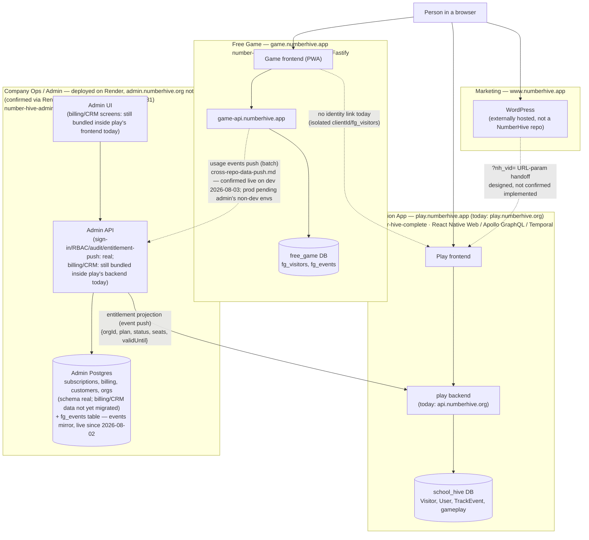

# NumberHive Platform Overview

**Start here.** This is the entry point for understanding how NumberHive's technical
architecture fits together as one platform — a high-volume public game, a sensitive
education product, and a company-ops/admin layer, plus the cross-cutting question of
whether (and how) a person can be tracked as they move between them. Everything below
links out to the fuller documents that already cover each piece in depth; this page's job
is to be the map, not to duplicate them.

---

## 1. The platform, in one diagram

Dotted lines are **designed but not confirmed/implemented**. Solid lines are live today.
`AdminArea`'s billing/CRM boxes (`AdminFE`, and `AdminDB`'s subscriptions/billing/customers
data) still describe the *target* shape from ADR-005 — that code and data still live
physically inside `number-hive-complete`. `AdminAPI`'s sign-in/RBAC/audit-log/
entitlement-push scaffolding is real and running in the `number-hive-admin` repo as of
2026-08-01. The events mirror shipped to production 2026-08-02 (CHG-3975/CHG-3976) — it was
built against a dev-only ClickHouse store initially, then migrated onto the same Admin
Postgres database (`fg_events` table, CHG-4093) before shipping, so it's shown above as part
of `AdminDB` rather than as a separate analytics store — see `system-overview.md`'s
data-ownership table and `docs/conventions/cross-repo-data-push.md` for what's actually built
vs. still target state.

The `GameAPI -> AdminAPI` edge is a partial exception to the dotted-line rule above: both
ends of that push are built and shipped (receiving side 2026-08-02, sending side
`number-hive-newvis` CHG-3977 2026-08-01), and as of 2026-08-03 a smoke test confirmed the
full mechanism actually works end-to-end (event insert → worker poll → push → 2xx → cursor
advance, verified via a marked test event). It's still shown dotted not because it's
unimplemented or unproven, but because it's confirmed on the **dev** environment only — the
sending worker is deliberately kept dev-only until `number-hive-admin` has staging/production
environments of its own, so there's no continuously-live production path yet. See
`docs/conventions/cross-repo-data-push.md`'s flow table for the up-to-date status.

---

## 2. The three areas, and why they're kept apart

| | Free Game | Education App | Admin / Company Ops |
|---|---|---|---|
| **Traffic profile** | High-volume, spiky, viral by design | Steady, school-hours patterns, paying customers | Low-volume, internal, staff-only |
| **Data sensitivity** | Anonymous by design — no PII, COPPA / UK Children's Code | Student data — FERPA, GDPR, UK Children's Code **under school consent** | Billing, customer PII, org records |
| **Repo** | `number-hive-newvis` | `number-hive-complete` | `number-hive-admin` (deployed on Render — branch `main`, auto-deploy on, not suspended; `admin.numberhive.org` itself not yet wired — parked GoDaddy IP, expired TLS cert, confirmed 2026-08-31) |
| **Database** | `free_game` (separate Atlas DB) | `school_hive` (separate Atlas DB) | Own Postgres (real) — including an `fg_events` events-mirror table, live since 2026-08-02 — billing/CRM data itself still lives in `school_hive` pending migration |
| **Why separated** | A viral traffic spike must never degrade the paying school product; different compliance regime entirely | — | A bug/breach in the public site currently shares blast radius with billing/PII because it's the same schema/DB/deploy today |

This three-way split is not incidental — it's the
load-bearing architectural decision of the whole platform. The full reasoning lives in
`number-hive-complete`'s ADRs, which stay authoritative there and are only linked from here:

- [ADR-001](../../number-hive-complete/docs/adr/001-free-game-infrastructure.md) — free game vs. education app: separate DBs, same Atlas project, why a shared DB was rejected
- [ADR-002](../../number-hive-complete/docs/adr/002-free-game-data-architecture.md) — free game identity/data model
- [ADR-003](../../number-hive-complete/docs/adr/003-migration-safety.md) — protecting live users through backend evolution
- [ADR-004](../../number-hive-complete/docs/adr/004-offline-first-and-cdn.md) — free game's offline-first/CDN deployment model
- [ADR-005](../../number-hive-complete/docs/adr/005-numberhive-admin-separation-and-amber-data-access.md) — extracting admin from the education app; the entitlement event-push mechanism

**One writer per data domain, no shared databases, no direct cross-service DB access anywhere on this diagram.** See [`system-overview.md`](system-overview.md) for the full data-ownership table. For *how* data legitimately moves between repos given that constraint (e.g. usage stats reaching `number-hive-admin`, or admin's entitlement data reaching play) — push, not pull; see [`conventions/cross-repo-data-push.md`](../docs/conventions/cross-repo-data-push.md).

---

## 3. Cross-surface user tracking — the open question

This is the piece that doesn't have a home anywhere else, so it lives here: **can we tell
that the same person moved from an ad, through the marketing site or free game, into a
paid school subscription?**

### Today: three separate identity islands

| Property | Identity | Storage | Linked to the others? |
|---|---|---|---|
| `www.numberhive.app` (WordPress) | Unknown / unconfirmed | Unknown | **No** |
| `game.numberhive.app` (free game) | `clientId` UUID | `fg_visitors` (`free_game` DB) | **No** — deliberately isolated (ADR-001 compliance reasoning) |
| `play.numberhive.app` (education app) | `nh_vid` UUID | `Visitor` collection (`school_hive` DB) | — the most mature pipeline, but nothing external feeds into it today |

So right now, a single teacher's journey — ad click → marketing site → free game →
sign-up → subscription — can produce **up to three unrelated anonymous identities** with
no link between them. The "which ad ultimately drove this subscription" question can't be
answered end-to-end yet.

### What's already built (in the education app's backend)

- `nh_vid` — a client UUID, with first-touch UTM/referrer/country captured once and **frozen** on the `Visitor` record
- `POST /api/visitor/identify` — create-or-touch a visitor
- `POST /api/visitor/link` — stitches the anonymous `nh_vid` to an authenticated `User` at signup, preserving original ad attribution through to conversion
- CORS already wildcarded on these endpoints — built with an external (marketing-site) caller in mind, even though nothing calls them cross-origin yet

### The two gaps

1. **WordPress isn't confirmed to call any of this.** No one has verified what tracking (if any) actually runs on the marketing site today, or whether it could emit anything usable for a handoff.
2. **The only designed handoff mechanism is fragile.** A `?nh_vid=<uuid>` URL param appended to outbound links, read on boot by the app. This survives exactly one click-through — it does nothing for a visitor who closes the tab and returns later, which is the common case, not the edge case.

### The fix that's now feasible

Now that `www`, `game`, and `play` all sit under the same registrable domain
(`numberhive.app`), a **single first-party cookie set with `Domain=numberhive.app`** would
be shared automatically across all three surfaces — no cross-domain hacks required. It
should be set **server-side** (Safari ITP caps JS-set cookie lifetimes at 7 days; server-set
cookies aren't subject to that cap). Combined with the existing `nh_vid` / `Visitor` /
`link` pipeline, this gives a durable identity that survives across sessions and
subdomains, with first-touch ad attribution preserved all the way to subscription. The
`?nh_vid=` param handoff isn't wasted by this — it still helps on the very first
click-through, before the cookie exists; the two mechanisms complement each other.

`admin.numberhive.org` is deliberately **outside** this cookie's domain scope — staff
tooling has no need for, and shouldn't hold, customer visitor identity.

### Still missing to make this real

- `game.numberhive.app`'s isolated `clientId`/`fg_visitors` identity would need to either adopt `nh_vid` or be merged into the same identity space — flagged as "under consideration" in `platform-strategy.md`, not decided
- Someone needs to check what WordPress actually has installed today, and instrument it to set/read the shared cookie
- None of this is implemented yet — this is a designed-but-unconfirmed state, not a live pipeline

### Governing convention for whatever gets built

Any tracking implementation, on any surface, must follow the audience-separation and
privacy rules already agreed as an ecosystem-wide convention — see
[`conventions/analytics-and-ops-logging.md`](../docs/conventions/analytics-and-ops-logging.md)
(product/growth vs. ops/security kept separate, scoped read-only DB credentials, no bespoke
query UI, aggregate-first reporting).

The full domain-by-domain detail behind this section — live vs. not-yet-created subdomains,
the `.app`/`.org` convention, backend-domain naming — lives in
[`subdomain-map.md`](subdomain-map.md); this section is the "why it matters for the
business" summary, that one is the "what's actually configured" reference.

---

## 4. Where to go next

| Question | Document |
|---|---|
| Which repo owns which subdomain, and what's actually live vs. still DNS-unresolved? | [`subdomain-map.md`](subdomain-map.md) |
| What's the actual URL/port for each surface, per dev/staging/production, cited to source? | [`environment-urls.md`](environment-urls.md) |
| Which repo owns which data, and how do the pieces relate at a glance? | [`system-overview.md`](system-overview.md) |
| Why are the free game and education app on separate databases? | [ADR-001](../../number-hive-complete/docs/adr/001-free-game-infrastructure.md) |
| Why is admin being split out? | [ADR-005](../../number-hive-complete/docs/adr/005-numberhive-admin-separation-and-amber-data-access.md) |
| What are the shared rules for analytics/ops logging across repos? | [`conventions/analytics-and-ops-logging.md`](../docs/conventions/analytics-and-ops-logging.md) |
| How should one repo's data reach another (e.g. usage stats into admin) without direct DB access? | [`conventions/cross-repo-data-push.md`](../docs/conventions/cross-repo-data-push.md) |
| What's the original two-frontend split proposal this platform grew out of? | [`platform-strategy.md`](platform-strategy.md) |

---

*Created 2026-07-25 as the entry-point document tying together the architecture already
captured piecemeal in `system-overview.md`, `subdomain-map.md`, and `number-hive-complete`'s
ADRs — none of which previously stated the platform's shape as a single diagram, or gave the
cross-surface tracking gap a dedicated home.*
