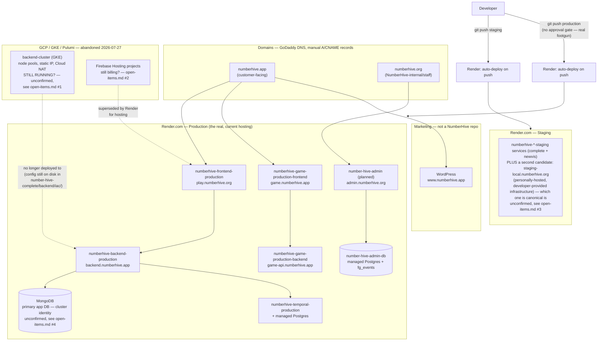

# Incoming Technical Lead Handover — NumberHive Ecosystem

**Purpose:** everything a new incoming technical lead (David) needs to pick up technical
ownership of NumberHive from James. Written 2026-08-28, cross-checked against the live repos rather than transcribed
from memory or old docs — see the provenance notes throughout.

**Status:** first full pass. The three docs in this folder plus the existing `architecture/`
docs together are the handover package. [`open-items.md`](open-items.md) lists what still needs an answer or a
decision before (or shortly after) handover completes — read that one even if you skim
everything else.

---

## Start here

1. **This file** — orientation: what NumberHive is, the repo map, how building/deploying
   actually works day to day.
2. **[`tech-inventory.md`](tech-inventory.md)** — domains, hosting, databases, every
   third-party service, costs, and where credentials live. Reconciled against what's actually
   deployed, not just what an older internal doc said.
3. **[`open-items.md`](open-items.md)** — things that need a decision, a verification, or an
   action, ranked by how much it'd hurt if left undone. Some of these are pre-existing gaps
   (backups, security policy, incident response were never documented); some are things I
   found doing the reconciliation (a cloud cluster that may still be running and billing with
   nothing pointing at it; two zombie repos).

Then, for the actual system architecture (not infra/ops, but what the product *is* and how the
pieces fit together), the existing docs in this repo are the canonical source and I haven't
duplicated them here:

- **[`../architecture/platform-overview.md`](../architecture/platform-overview.md)** — start
  here for the product itself: the whole platform in one diagram.
- **[`../architecture/system-overview.md`](../architecture/system-overview.md)** — the three
  areas (school product, free game, admin), who owns what data, which ADR governs each
  boundary.
- **[`../architecture/environment-urls.md`](../architecture/environment-urls.md)** — the
  single most load-bearing doc for infra reality: every URL/port per environment, cited to
  each repo's actual deploy config, with known drift and contradictions flagged rather than
  papered over. This is what caught the dead GKE/Pulumi path (see below) — read it before
  trusting any older doc (including the original tech inventory) on infra questions.
- **[`../architecture/subdomain-map.md`](../architecture/subdomain-map.md)** — domain scheme
  and rationale (`.app` = customer-facing, `.org` = NH-internal/staff).

---

## What NumberHive is

An educational product for schools (the paid "school product") plus a free public game that
funnels into it, plus emerging internal company-ops tooling. Not one application — a small
family of repos, each owning its own data, talking to each other over defined APIs/event
pushes rather than sharing databases. [`system-overview.md`](../architecture/system-overview.md) is the authoritative map; the
one-paragraph version:

| Area | Repo | Status |
|---|---|---|
| School product (the paid app) | `number-hive-complete` | **Live** — this is the main live system |
| Free game | `number-hive-newvis` | Live, in active development |
| Company operations / admin | `number-hive-admin` | In development — only Google OAuth sign-in and an events mirror are live so far; billing/customer data hasn't migrated out of `number-hive-complete` yet |
| Marketing site (`www`) | Not a NumberHive repo | Live — WordPress, externally hosted |
| Ecosystem documentation (this repo) | `number-hive-documentation` | Cross-repo architecture, conventions, and (as of this handover) onboarding docs |

## The infrastructure, in one diagram

[`platform-overview.md`](../architecture/platform-overview.md) already diagrams the *product* shape (which repo owns which data).
This one is the complementary *infra/ops* view — what's actually deployed, where, and the one
open question (the greyed-out GCP box) that [`open-items.md`](open-items.md) #1 asks you to resolve:

**Solid lines are live today. Dotted lines are dead/superseded paths** — the opposite emphasis
from [`platform-overview.md`](../architecture/platform-overview.md)'s diagram (there, dotted means "designed but not yet built"; here,
dotted means "used to be true, isn't the deploy path anymore"). The two grey boxes in
`Legacy` are exactly [`open-items.md`](open-items.md) #1 and #2 — nobody has confirmed they're actually turned
off, only that nothing deploys to them anymore.

---

## Repos that are *not* part of the live system

Two repos exist in the NumberHive GitHub org that look like they might be live infrastructure
but are not — worth knowing before you go looking for what deploys them:

| Repo | Last commit | What happened to it |
|---|---|---|
| `number-hive-backend` | 2026-03-16 | Superseded — its `iac/` (Pulumi) and `cloudbuild.yaml` were absorbed byte-for-byte into `number-hive-complete/backend/` on 2026-03-14 ("chore: initial monorepo setup"). Confirmed identical content via diff. Nothing has been pushed to it since; it's a fossil, not a fallback. |
| `number-hive-app` | 2026-03-12 | Same story — this was the standalone React Native mobile app repo. `number-hive-complete/CLAUDE.md` now states plainly: *"iOS/Android builds are not maintained"* — the frontend in the monorepo is web-only. |

Neither is archived on GitHub (`archived: false` as of this check) — see [`open-items.md`](open-items.md)
for the recommendation on that.

---

## How building and deploying actually works

**Hosting: Render.com is the real, current answer for every live service.** `number-hive-complete`,
`number-hive-newvis`, and `number-hive-admin` all deploy via `render.yaml` Blueprints. There is
**no live Kubernetes/GKE deployment** despite what an older internal doc says — see the
correction below.

**Branch → environment convention** (from `number-hive-complete/CLAUDE.md`, and consistent
across the other repos):

- `main` (or `develop`, repo-dependent) — integration branch
- `staging` — deploys to a staging environment on push
- `production` — deploys to Render production **automatically on push**. Every repo's own
  CLAUDE.md is emphatic about this: never push to `production` without an explicit
  instruction to do so, every time, no exceptions. This is a real footgun, not boilerplate
  caution — a push to that branch ships to real users immediately.

**Local development** runs via Docker Compose in each repo (`docker-compose.yml` /
`docker-compose.dev.yml`) — see each repo's own `CLAUDE.md`/`README.md` for the exact commands,
they differ slightly per repo.

### The GKE/Pulumi correction — read this before trusting any older doc on infra

The backend architecture was originally built as GCP + GKE + Pulumi-provisioned Kubernetes,
with staging/production namespaces, node pools, Cloud Build triggers, the works. **That was confirmed abandoned by the user on
2026-07-27** (recorded in [`environment-urls.md`](../architecture/environment-urls.md)) — it was an earlier infra
approach that was never cleaned up from disk, not a live path. The actual, current production
backend is `backend.numberhive.app`, served from Render, confirmed both against the live
Render dashboard and against the app's own production secrets file.

**This matters for handover in one concrete way: nobody has confirmed whether the GCP/GKE
infrastructure itself was ever torn down.** "Not used" in the deploy pipeline is not the same
as "doesn't exist and isn't billing." See [`open-items.md`](open-items.md) #1 — this is the single highest-value
thing to verify early, since if the cluster is still running it's both a live cost and a live
(unmonitored) attack surface.

---

## Suggested first week for David

1. Read [`../architecture/platform-overview.md`](../architecture/platform-overview.md), then [`system-overview.md`](../architecture/system-overview.md), then
   [`environment-urls.md`](../architecture/environment-urls.md) in that order — product, then map, then ground-truth infra state.
2. Read [`open-items.md`](open-items.md) in full and pick which items you want to personally verify vs. delegate
   vs. accept as "known gap, revisit later."
3. Get Render dashboard access (all three live services are there) and GCP console access
   (to resolve the GKE question) before anything else — those two unlock verifying most of
   [`open-items.md`](open-items.md) yourself rather than taking this doc's word for it.
4. Get GoDaddy/DNS access sorted explicitly — see [`tech-inventory.md`](tech-inventory.md)'s access section; it's
   currently informally delegated and that should become an explicit, documented arrangement.
