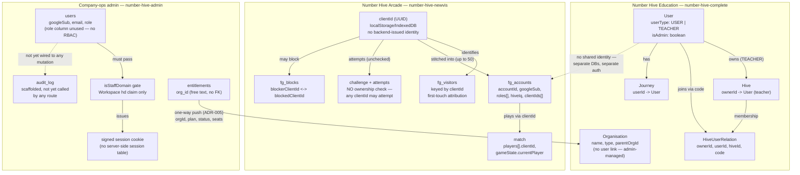

# Access Model — identity and authorization across the three systems

**Purpose:** a single place that answers "who can do what, and how is that actually checked in
code" for all three NumberHive systems — Number Hive Education (`number-hive-complete`), Number
Hive Arcade (`number-hive-newvis`), and company-ops admin (`number-hive-admin`). Each system
built its own identity model independently; there is no shared user/session store anywhere (see
[`../architecture/system-overview.md`](../architecture/system-overview.md) — "one writer per
data domain"). This document exists so the incoming technical lead doesn't have to reconstruct
that picture from three separate codebases before making a security-relevant change.

Everything below is cited to exact file paths (and line numbers/ranges where feasible), gathered
by reading the code directly on 2026-08-31. Where the code's behaviour is ambiguous or looked
like it might be an oversight rather than a decision, that's flagged explicitly rather than
smoothed over.

---

## 1. Number Hive Education (`number-hive-complete`)

**Identity:** a `User` document. Authorization-relevant fields, in
`backend/src/database/models/user.ts`:
- `userType: UserType` — an enum with exactly two values, `USER` (student) and `TEACHER`, defined
  in `backend/src/constants/user-type.ts`.
- `isAdmin: boolean` — a separate, orthogonal flag (a teacher or a student account can in
  principle carry it, though in practice it's used for NH staff admin accounts).
- There is also a `UserRole` enum (`backend/src/constants/user-roles.ts`) containing only one
  value, `AUTHENTICATED` — it doesn't carry a role hierarchy; `userType` + `isAdmin` do that work
  instead.

**GraphQL resolver protection:** the `@Authorized()` decorator (type-graphql), backed by an
`authChecker` function in `backend/src/services/auth-service.ts` (lines 10–20). As used across
this codebase it's called with no arguments — it only asserts the request is authenticated
(`context.userId` is set), not that any particular `userType` holds. Seen on resolvers throughout
`backend/src/graphql/**` (e.g. `journey.resolver.ts`).

**Credential model:** the token that `@Authorized()` and `authenticateAdmin` both rely on has its
own gaps — `validateAccessToken` checks a token by DB lookup only, without verifying the JWT
signature, and refresh tokens carry a 30-year expiry — see
[`security-remediation-status.md`](security-remediation-status.md) for the full detail and
remediation status. This document covers identity, authorization, and ownership/scope; that one
covers the credential itself.

**Admin gating:** a separate middleware, `authenticateAdmin`
(`backend/src/services/auth-service.ts`, lines 100–105), applied via `@UseMiddleware(authenticateAdmin)`
on admin-only resolvers (e.g. `backend/src/graphql/admin/users/users.resolver.ts`). It checks
`context.user?.isAdmin === true` and throws `Errors.ACCESS_DENIED` otherwise — a flat boolean
gate, not a role hierarchy.

**Hive ownership and membership:**
- `Hive.ownerId` (`backend/src/database/models/hive.ts`, line 43) — a `Ref<User>` to the teacher
  who created the Hive (a Hive is the code-side name for a class/group — see the glossary in
  [`README.md`](README.md)).
- `HiveUserRelation` (`backend/src/database/models/hive-user.ts`, lines 22–37) — the
  membership/join record: `ownerId`, `userId` (the student), `hiveId`, and `code` (the join-code
  used). Indexed on `{ userId, code }` and uniquely on `{ ownerId, userId, hiveId }`.
- **Join-code flow** (`backend/src/graphql/hive/join-hive/join-hive.service.ts`, lines 14–57):
  requires `userType === USER` (only students can self-join), looks the Hive up by its code, and
  creates the `HiveUserRelation`. **There is no owner-approval step** — anyone who knows a valid
  code and is a student-typed account can join. This is a deliberate low-friction design, not
  obviously a bug, but worth knowing: the join-code is a bearer secret, not a request that a
  teacher approves.
- **Ownership/membership checks on Hive data reads**
  (`backend/src/graphql/hive/hive-users/hive-users.service.ts`, `getHiveUsers` at lines 16–99 and
  `getHiveUser` at lines 101–150): a teacher must own the Hive (`Hive.exists({ _id: hiveId,
  ownerId: currentUser._id })`); a student must be a member (`HiveUserRelation.exists({ userId:
  currentUser._id })`), and can only view their own profile within it, not a classmate's.

**A gap worth flagging, found while reading this code (not previously documented anywhere):**
`backend/src/graphql/hive/remove-user-from-hive/remove-user-from-hive.service.ts` (line 11)
only checks `userType === TEACHER` before removing a student from a Hive — it does **not** verify
the requesting teacher actually owns the specific Hive in question. As written, any
teacher-typed account can remove any student from any Hive, not just their own. This reads like
an oversight rather than a decision (every other Hive-mutating path in this service checks
ownership). Worth a fast follow-up fix; added to
[`open-items.md`](open-items.md) rather than fixed silently here, since it's a behaviour change
outside this handover pass's scope.

### Subscription lifecycle: Stripe as the system of record

Everything below was read directly from `number-hive-complete/backend/src` and
`number-hive-admin/server/src` on 2026-08-31. Where the code doesn't answer a question, that's
stated as "not found in code" rather than inferred.

**The principle, stated up front:** Stripe decides whether a hive is paid; the application never
computes that for itself. It only ever learns Stripe's decision when Stripe tells it — either via
the synchronous Stripe API check on the checkout-return redirect, or via the asynchronous webhook,
which is the authoritative, guaranteed-eventually path. `Hive.paymentStatus` and
`Subscription.status` are local caches of what Stripe last reported, not independently derived.

**1. What creates the Stripe Checkout session**

`GET /api/subscription/stripe/checkout` (mounted at `router/api/subscription/index.ts:6`), handled
by `checkout()` in `backend/src/router/api/subscription/stripe/stripe.api.ts:14-71`:
- Requires an authenticated teacher who owns the target hive, and blocks re-entry only if the hive
  is already `Active` (lines 23-31) — a `Pending` or `Canceled` hive is not blocked from starting a
  new checkout.
- Creates or reuses a Stripe customer (lines 40-45), then calls `payment.createHiveSubscription()`
  to create the Stripe Checkout Session (line 47).
- **First write in the whole sequence:** `HiveDB.updateOne({_id: hiveId}, {sessionId, paymentStatus:
  PaymentStatus.Pending})` (line 53) — this happens before Stripe or the webhook has said anything;
  it just marks that a checkout attempt is in flight.
- Redirects the browser to Stripe's hosted Checkout page (line 67).

On return, `GET /api/subscription/stripe/subscribe/complete` → `checkoutComplete()` (lines 73-99)
does a **best-effort synchronous check**: it calls `payment.getSessionDetails(session_id)` and, if
Stripe reports `paid` or `no_payment_required`, sets `Hive.paymentStatus = Active` immediately
(lines 83-88). This is still "told by Stripe" — it's a direct Stripe API read, not a local
inference — but it's synchronous and best-effort; the code's own comment (line 78) says the webhook
is the backup if this fails. So there are two paths that can set a hive Active, both sourced from
Stripe, not computed locally.

**2. Webhook events → field writes**

Raw Stripe event names are mapped to an internal `SubscriptionType` enum in
`backend/src/utils/stripe.ts`'s `validateWebhook()`, then handled by a second switch in
`backend/src/router/api/webhooks/stripe/stripe.api.ts`. One correction to note up front: **`invoice.paid`
and `invoice.payment_succeeded` are two different Stripe events**, mapped to two different internal
types — only `invoice.payment_succeeded` touches `Hive`/`Subscription` status; `invoice.paid` is
ledger-only (see below).

| Stripe event | Maps to (`stripe.ts`) | Handler (`stripe.api.ts`) | Writes `Hive` | Writes `Subscription` |
|---|---|---|---|---|
| `checkout.session.completed` | `Created` (282-295) | 95-148 | `paymentStatus: Active` or `PaymentFailed`, found by `sessionId` (97-100) | update (134) or create (138): `stripeCustomerId`, `status`, `committed: true`, `paymentChannel: stripe`, `hiveIds`, `productId` |
| `customer.subscription.created` | `SubscriptionCreatedDirect` (300-314) | 210-284 | none directly; best-effort backfill of the owner's `Pending` hives if no existing sub was found (245-248) | enriched fields (`currentPeriodStart/End`, `cancelAtPeriodEnd`, `canceledAt`, coupon, interval, quantity, discount, currency, `unitAmount_USD`) + `stripeCustomerId`/`status`/`productId` |
| `customer.subscription.updated` | `SubscriptionUpdated` (315-329) | 285-330 | none — never touches `Hive` | same enriched fields + `status`, on the existing sub found by `stripeSubscriptionId`; silently no-ops if not found |
| `customer.subscription.deleted` | `Canceled` (265-272) | 149-172 | `paymentStatus: Canceled` for every hive in `hiveIds` (153) | `status: canceled` (171) |
| `invoice.payment_succeeded` | `PaymentSucceeded` (273-277) | 182-195 | `paymentStatus: Active` for every hive in `hiveIds` (186) | `status: active`, `lastInvoiceAmount_USD`, `lastInvoiceDate`, `currency` (189-194) |
| `invoice.payment_failed` (first `case`, the one that wins) | `PaymentFailed` (278-281) | 173-181 | `paymentStatus: PaymentFailed` for every hive in `hiveIds` (177) | `status: past_due` (180) |
| `invoice.paid` | `InvoicePaid` (335-338) | 331-342 | none | none — ledger-only: `upsertInvoice()`/`upsertChargeForInvoice()` write to the separate `subscriptionInvoices`/`subscriptionCharges` collections |

`Subscription.hiveIds` is written only at `checkout.session.completed` time (both the update and
create branches) — this is the field the model comment calls "the owning side" of the hive↔
subscription relationship. `Subscription.seats` is a modelled field (`subscription.ts:96-97`) that
**no webhook path writes** — not found in code; the field that Stripe's line-item quantity actually
populates is the separate `quantity` field (`subscription.ts:153-154`), enriched on
`subscription.created`/`updated`.

**Ordering:** a teacher's first payment typically produces `checkout.session.completed` and
`customer.subscription.created` close together; Stripe does not guarantee their relative order, and
this code does not depend on one arriving before the other — both write by lookup key
(`sessionId`/`stripeSubscriptionId`) rather than assuming a prior state. `invoice.payment_succeeded`
follows once the first invoice is actually paid, reaffirming `Active`. Ongoing: `subscription.updated`
on plan changes, `invoice.payment_failed` on a failed renewal, `subscription.deleted` on
cancellation.

**3. What `Hive.paymentStatus` actually gates**

Read every resolver/service touching `paymentStatus` across the backend. There is exactly **one**
hard gate on a student- or teacher-facing action:
- `HiveDB.joinHive()` (`backend/src/database/controllers/hive.db.controller.ts:22-55`) — an atomic
  `findOneAndUpdate` that only matches `{code, paymentStatus: PaymentStatus.Active}`. A student
  cannot join a hive by its code unless the hive is `Active`, regardless of `NotPaid`, `Pending`,
  `Canceled`, or `PaymentFailed`.
- The checkout handler itself blocks a teacher from starting a new checkout only when the hive is
  already `Active` (`stripe.api.ts:29-31`) — `NotPaid`, `Pending`, `Canceled`, and `PaymentFailed`
  all permit starting (or restarting) checkout.

Everything else that reads `paymentStatus` is non-gating:
- Admin-panel filtering, display, and KPI tallies only —
  `graphql/admin/hives/hives.service.ts`, `graphql/admin/users/users.service.ts`,
  `graphql/admin/subscriptions/subscriptions.service.ts`.
- Audit/reconciliation reporting — `graphql/admin/subscription-audit/subscription-audit.service.ts`
  compares `Subscription.status` against `Hive.paymentStatus` to surface mismatches; it doesn't act
  on them.
- One soft, non-blocking usage: `services/follow-up/follow-up-aggregation.ts` (lines 66, 262, 278)
  sets a `hasPaymentIssue` flag when any hive snapshot is `PaymentFailed`, which shapes the wording
  of an AI-generated teacher follow-up email (`follow-up-prompt.ts:71`). It changes email content,
  not access.

Stated plainly, since the absence of a finding is itself a finding: **no gameplay or content
resolver (Journey, GamePlayed, etc.) reads `Hive.paymentStatus` at all.** A student who is already a
`HiveUserRelation` member is not, from what this pass found, cut off from existing content when a
hive lapses to `Canceled` or `PaymentFailed` — only new joins are blocked. Whether that's intended
(don't punish enrolled students for a billing lapse) or an oversight is not something the code
answers; not found in code.

**4. The non-Stripe paths**

`PaymentChannel` (`subscription.ts:31-35`) has three values: `stripe`, `external`, `none`.
- **`external`** is written through the admin `createBillingSubscription`/`updateBillingSubscription`
  mutations (`graphql/admin/billing-subscriptions/billing-subscriptions.service.ts:246-308`) — an
  admin can create or edit a `Subscription` document with an arbitrary `paymentChannel`, including
  `external`, directly from GraphQL input. It's read back by two admin reporting services
  (`under-charged.service.ts:12`, `flight-risk.service.ts:15`) that treat `external` subscriptions
  as invoiced/manually-billed accounts (e.g. schools on a purchase order rather than a card).
- **`none`** is used as a placeholder marker: `admin/subscription-sync/subscription-sync.service.ts`
  treats `{committed: false, paymentChannel: none}` records as provisional rows, superseded and
  deleted once a real `stripe`-channel subscription covering the same `hiveIds` appears (lines
  128-151). It's also settable via the same admin mutation above.
- **Whether they bypass Stripe entirely: yes.** The webhook handler switch is the only place
  `paymentChannel` is set to anything by live traffic, and it only ever writes `PaymentChannel.stripe`
  (the sole three write sites in the whole backend: `stripe.api.ts:127, 142, 255`). `external`/`none`
  records are entirely admin-CRUD-authored and carry no requirement for a `stripeSubscriptionId`.
- **A gap found while checking this:** neither `createBillingSubscription` nor
  `updateBillingSubscription` writes anything to `Hive.paymentStatus` — read both functions in full,
  no `HiveDB` call appears in that file. So marking an organisation's billing as `external` (e.g. an
  invoiced school) does not, by itself, flip the covered hives to `Active`. How (or whether) that
  second step happens is not found in code — not in the admin hives/users/subscriptions resolvers
  either, which are all read-only on `paymentStatus`. This may be an intentional manual step, or a
  gap; reported as "not found in code," not assumed either way.

**5. The financial reconciliation job (`tech-inventory.md` §7)**

`startFinancialReconciliationScheduler()` (`backend/src/services/digest-scheduler.ts:66-109`), an
in-process `node-cron` job running nightly at 02:00 UTC (line 68), pulls the last 30 days of Stripe
invoices (line 71) and calls `upsertInvoice()`/`upsertChargeForInvoice()`
(`financial-ingestion.service.ts:63-99`) for each. Read both files in full: every write goes to the
separate `subscriptionInvoices`/`subscriptionCharges` ledger collections. `resolveSubscription()`
inside `upsertInvoice()` looks up the matching `Subscription` only to link the ledger row — it is
read-only; nothing in this job writes to `Subscription.status` or `Hive.paymentStatus`.

**Would it repair a missed webhook? No.** If a `checkout.session.completed` or
`invoice.payment_succeeded` webhook were dropped, this job would still correctly backfill the
invoice/charge ledger (it pulls straight from Stripe, independent of webhooks) but would leave
`Subscription.status` and `Hive.paymentStatus` stale — neither field is in its write path.

Separately, `admin/subscription-sync/subscription-sync.service.ts`'s `runSubscriptionSync()` *is*
described in its own header comment as "the catch-up mechanism for missed webhooks," and does
upsert `Subscription` documents from Stripe's live subscription list — but it is not on any
schedule; it's triggered by an admin-only GraphQL mutation
(`adminRunSubscriptionSync`, gated by `authenticateAdmin` —
`subscription-sync.resolver.ts`), so it only runs when an admin invokes it. And even this path only
ever writes `Subscription` fields (`paymentChannel: stripe`, `status`, enrichment) — no `HiveDB`
call appears anywhere in that file either. So neither of this codebase's two Stripe-catch-up
mechanisms repairs a stale `Hive.paymentStatus` — only `Subscription.status` gets a manual-trigger
catch-up path at all.

**6. Sequence: teacher → hive paid**

```mermaid
sequenceDiagram
    participant T as Teacher
    participant E as Education app
    participant S as Stripe Checkout
    participant W as Stripe webhook

    T->>E: GET /checkout (hiveId)
    E->>S: createHiveSubscription()
    E->>E: Hive.paymentStatus = Pending, Hive.sessionId = session
    E-->>T: 303 redirect to Stripe-hosted Checkout
    T->>S: completes payment on Stripe's page
    S-->>T: redirect to /subscribe/complete
    T->>E: GET /subscribe/complete?session_id
    E->>S: getSessionDetails(session_id) [best-effort]
    E->>E: Hive.paymentStatus = Active (if paid)
    S->>W: checkout.session.completed
    W->>E: POST /webhooks/stripe
    E->>E: Hive.paymentStatus = Active/PaymentFailed (by sessionId); Subscription created/updated
    S->>W: invoice.payment_succeeded
    W->>E: POST /webhooks/stripe
    E->>E: Hive.paymentStatus = Active (reaffirmed); Subscription.status = active
```

**7. ADR-005, as it stands in code**

[ADR-005](https://github.com/NumberHive/number-hive-complete/blob/main/docs/adr/005-numberhive-admin-separation-and-amber-data-access.md)
itself is still marked "Proposed — pending review; no implementation started, no tracked Change
opened" (line 4) — yet `number-hive-admin` already contains a substantial, unit-tested
implementation of the mechanism it describes, built ahead of the ADR being formally accepted:

- `server/src/entitlements/entitlementsRepo.ts` (61 lines): an `Entitlement` interface —
  `{orgId, plan, status, seats, validUntil}` (lines 3-9) — matching ADR-005's projection shape
  exactly, backed by a Postgres `upsert`/`listAll` (lines 12-49).
- `server/src/entitlements/service.ts` (46 lines): `recordEntitlementChange()` upserts the
  entitlement locally, then fires a background `entitlement.changed` push — fire-and-forget; a push
  failure after all retries is logged, never thrown, with an explicit comment (lines 12-20) that the
  local DB row is the source of truth and the hourly reconciliation pass is the backstop.
- `server/src/entitlements/pushClient.ts` (117 lines): builds a signed envelope
  (`{sourceRepo, eventType, occurredAt, idempotencyKey, payload}`, matching
  [`cross-repo-data-push.md`](../docs/conventions/cross-repo-data-push.md) §4 per its own comment,
  line 6); signs the raw JSON body with HMAC-SHA256, sent as `X-Signature: sha256=<hex>` (lines
  26-29, 94-96); retries with bounded exponential backoff — 5 attempts, 1s/2s/4s/8s/16s — on network
  error, 429, or 5xx only (lines 60-65, 78-117).
- `server/src/entitlements/reconcile.ts` (63 lines): an hourly loop
  (`RECONCILIATION_INTERVAL_MS = 60 * 60 * 1000`, line 9) that re-pushes every known entitlement as
  `entitlement.reconcile`, lock-guarded against overlapping runs (lines 48-62) — the backstop
  referenced above.
- The push target is environment-configured (`env.entitlementPushTargetUrl`/`entitlementPushSecret`,
  read at `server/src/index.ts:114, 318`), with a **hardcoded fallback default already committed** in
  `server/src/config/env.ts:110-111`: `process.env.ENTITLEMENT_PUSH_TARGET_URL ||
  'https://backend.numberhive.app/v1/internal/entitlements'`.
- The only current caller of `recordEntitlementChange()` is `POST /api/entitlements/test-push`
  (`server/src/routes/entitlements.ts`), which is explicitly self-documented in its own header
  comment (lines 42-57) as "temporary admin-only scaffolding" that exists only because "Tier 1's
  real subscription CRUD... doesn't exist yet" — there is no real, product-driven trigger for this
  push yet.

**Does Education have a receiving endpoint or a local projection model?** Independently searched the
whole `number-hive-complete/backend/src` tree, case-insensitive, for "entitlement" — **zero
matches.** No receiving endpoint, no local projection model, nothing in Education reads or writes an
entitlement concept anywhere.

**Therefore:** the mechanism ADR-005 describes is built and unit-tested on the admin side, but has
no real caller (only a manually-triggered test route) and no receiver on the Education side. It is
infrastructure for a future integration, not a live data path. `Hive.paymentStatus`, written
directly by Education's own Stripe webhook handler as documented above, remains the only thing any
part of this system actually gates on today.

Today, `Hive.paymentStatus` decides; the design is for admin's entitlements table to decide.

**Journey model — confirmed cross-tenant authorization gap, more severe than the Hive-removal one
above.** `Journey` (`backend/src/database/models/journey.ts`, lines 35–53) is a student's
progression through content, scoped by `userId`. Every resolver in
`backend/src/graphql/journey/journey.resolver.ts` carries `@Authorized()` only
(authentication-only — see above), and every read/write path that takes a client-supplied ID does
**no check anywhere that the ID belongs to `context.userId`**. Read directly, line by line:
- `journeysByUser` (line 29) — returns *any* user's full Journey list, given their `userId`.
- `journeyByUserAndGametype` (line 35) — same, scoped to one game type.
- `updateJourney` (line 47) — updates *any* Journey document by its `id`, arbitrary fields.
- `deleteJourney` (line 68) — deletes *any* Journey document by its `id`.
- `upsertJourney` (line 77) — creates or overwrites *any* user's Journey, given their `userId`.
- `addJourneyHistory` (line 98) — appends a history entry to *any* Journey by its `journeyId`.
- `upsertJourneyHistory` (line 108) — same, upsert form.

In practice: any authenticated user — student or teacher, anywhere in the system — can read,
overwrite, or delete any other user's Journey progression data simply by supplying their
`userId`/`id`/`journeyId`, none of which are validated against `context.userId` or any
ownership/membership relation. This is confirmed by direct reading of the resolver file, not
inferred. Also added as [`open-items.md`](open-items.md) item #23, since — unlike the
`remove-user-from-hive` gap above, which is scoped to Hive membership — this affects arbitrary
read/write/delete of any user's data with no Hive relationship required at all.

**Organisation** (`backend/src/database/models/organisation.ts`) — `name`, `type` (`school` |
`district` | `trust`), optional `parentOrgId`. Admin-managed; not linked to a `User` directly, so
it sits outside this identity picture rather than inside it.

---

## 2. Number Hive Arcade (`number-hive-newvis`)

Two parallel identities, not one — a visitor can be either, or move from the first to the second:

**Anonymous guest — `clientId`.** A UUID generated client-side
(`src/analytics/Identity.ts`, lines 254–308: `IdentityService`), persisted to `localStorage`
(key `anon_client_id`) with an IndexedDB fallback for private-browsing sessions (lines 341–352).
The backend never issues this ID — it trusts whatever the client sends. On the backend, `POST
/visitors` (`backend/src/routes/visitors.js`, lines 22–91) upserts a document in `fg_visitors`
keyed by `clientId`, capturing first-touch UTM/referrer/device data.

**Google-linked account — `fg_accounts`.** `backend/src/routes/auth.js` (lines 64–252) runs the
OAuth flow; on success it upserts an `fg_accounts` document with `accountId` (its own generated
UUID, not the Google `sub` directly used as primary key), `googleSub`, a hashed+encrypted email
(`emailHash`/`emailEncrypted`), `roles` (an array — `['player']`, or `['player',
'internal_tester']` for `@numberhive.app` staff accounts), `hiveIq` (the PvP rating — "Altitude"
in product terms, see the glossary), and `clientIds`: an array of up to 50 guest `clientId`
values that have been stitched to this account (the anonymous→authenticated linking mechanism,
lines 158–160 and 195).

**Match ownership and turn checks** (`backend/src/routes/matches.js`, lines 253–257, within the
broader auto-join handling starting ~line 225): a move
submission is checked against `match.gameState.currentPlayer`, matched by `clientId` against
`match.players[].clientId`. Whoever holds the right `clientId` for the current turn can move —
there's no separate "is this really the account that owns this clientId" check beyond that, which
is consistent with the whole system trusting client-presented `clientId`s as bearer identity
rather than requiring sign-in.

**Challenge attempts — confirmed no ownership check.** `POST
/challenges/:challengeId/attempts` (`backend/src/routes/challenges.js`, lines 189–236) accepts
any `clientId` in the request body and records an attempt against the given `challengeId` with no
check that the submitter was invited, is a "connection," or has any prior relationship to the
challenge creator. The file's own header comment (lines 177–182) states this explicitly: *"No
turn/ownership concept (unlike `/matches/:matchId/moves`) — any client can submit an attempt
against any known challenge id."* This is intentional (a "Play-Me link"/standing link is meant to
be a shareable, replayable open invitation — see the glossary in [`README.md`](README.md) for the
Play-Me link's product framing), not an oversight — it's called out here so it's legible as a
decision rather than something the incoming technical lead has to independently verify.

**Blocking** (`backend/src/lib/blockCheck.js`) — a directed `fg_blocks` collection
(`blockerClientId`, `blockedClientId`, `source`: `'manual'` or `'report'`), checked bidirectionally
via `isBlocked()` (lines 38–47). Enforced before standing-link/challenge redemption
(`routes/links.js`) and before starting a match from the roster (`routes/connections.js`).

There is **no Hive/Organisation concept anywhere in this system** — Arcade has no notion of a
class, group, or teacher; it's flat player-to-player.

---

## 3. Company-ops admin (`number-hive-admin`)

**Identity:** Google OAuth only, gated server-side to a single allowed Workspace domain (the
`hd` claim on the verified Google ID token) via `isStaffDomain`
(`server/src/auth/google.ts`, lines 70–79). There is no non-staff sign-in path — this system has
no customer-facing accounts at all, unlike the other two.

**Session:** stateless — no server-side session table. On sign-in
(`server/src/routes/auth.ts`, lines 71–83) the user is upserted into a `users` table
(`server/src/db/migrations/0001_create_users.sql`, line 9: `role TEXT NOT NULL DEFAULT 'staff',`)
and `setSessionCookie()` (`server/src/auth/session.ts`, lines 135–148) sets an HMAC-SHA256-signed
(lines 46–47), HttpOnly cookie — a base64url-encoded JSON payload plus a base64url-encoded HMAC
signature (line 56) — carrying `{ sub, email, name, picture, role, themePreference }` directly, a
12-hour sliding expiry, 7-day absolute cap (see `docs/adr/0001-stateless-session-cookie.md` in
that repo for the full rationale/trade-offs).

**RBAC: there isn't one, by explicit decision.** `users.role` exists as a column (default
`'staff'`) and rides along in the session cookie, but **nothing in the codebase branches on it**.
Per `server/src/auth/CONTEXT.md` (lines 53–94, quote at lines 55–56, dated line 57's 2026-07-27):
*"Admin = any request carrying a session that passed the staff-domain gate above. There are no
role tiers, and none are currently planned."* Every route that checks anything checks only "is
there a valid signed session" — see e.g. `server/src/routes/auth.ts` (line 41,
`readSessionEnvelope(...)`), `server/src/routes/auditLog.ts`, `server/src/routes/entitlements.ts`,
`server/src/routes/analyserQuery.ts`, all using the same inline `readSessionEnvelope(...)` pattern
rather than a shared middleware (a `requireAuth` middleware is defined at
`server/src/middleware/requireAuth.ts`, lines 26–47, with a comment at lines 14–24 explicitly
noting it isn't yet wired to any route — confirmed by search: zero imports of `requireAuth`
anywhere in non-test code). **If role-based access ever needs to be introduced here, it needs a
new, explicit decision — the schema is ready for it (the column exists) but the enforcement
isn't, anywhere.**

**Audit log** (`server/src/db/migrations/0003_create_audit_log.sql`,
`server/src/db/auditLogRepo.ts`, `recordAuditEvent()` at lines 33–39): schema and a
`recordAuditEvent()`/`listAuditEvents()` pair exist (actor email, action, target type/id, JSON
metadata, timestamp), readable via `GET /api/audit-log`. **Confirmed by a repo-wide search: no
route anywhere calls `recordAuditEvent()`** — the migration file's own comment (lines 1–2) says as
much: "No caller writes to this table yet — Tier 1 admin routes...don't exist in this repo yet."
It's scaffolding for a future tier of admin routes (CHG-3667), not a live trail of anything that's
happened so far.

**Entitlement push** (ADR-005) is a one-way data feed (`entitlements` table → pushed to
`number-hive-complete`), not an access-control mechanism — it doesn't determine who can access
what inside admin itself, only what a customer org is entitled to on the Education side.

**No Organization/Customer identity lives here yet.** `entitlements.org_id` is a free-text key,
not a foreign key to anything — the real organisation records still live inside
`number-hive-complete` pending the billing/CRM migration described in
[`../architecture/system-overview.md`](../architecture/system-overview.md).

---

## 4. Identity objects across all three systems



**Reading this diagram:** there is no cross-system identity today. A person who is a teacher in
Education, a player in Arcade, and a staff member in admin is three unrelated identity records,
in three separate databases, with no foreign key or shared token connecting them anywhere. That's
consistent with the "one writer per data domain, no shared databases" rule in
[`system-overview.md`](../architecture/system-overview.md) — it's a deliberate architectural
boundary, not an oversight, though it does mean there's no single place to answer "what can this
person do across the whole platform" without checking three systems separately.

---

*Written 2026-08-31 as part of the incoming technical lead's handover package. All claims cited
to file paths and line numbers read directly in each repo on that date, and cross-checked by a
second independent pass over each of the three repos before this was finalized; ambiguities and
possible gaps are flagged inline rather than smoothed over — see §1's `remove-user-from-hive` and
`Journey` resolver notes in particular, both also tracked in [`open-items.md`](open-items.md)
(items #22 and #23).*
