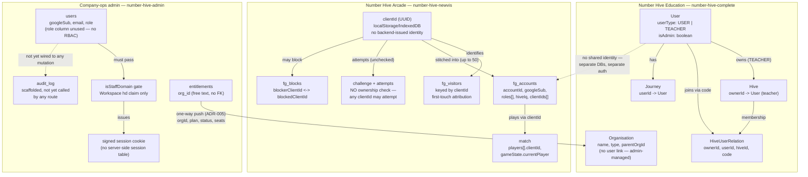

# Access Model — identity and authorization across the three systems

**Purpose:** a single place that answers "who can do what, and how is that actually checked in
code" for all three NumberHive systems — Number Hive Education (`number-hive-complete`), Number
Hive Arcade (`number-hive-newvis`), and company-ops admin (`number-hive-admin`). Each system
built its own identity model independently; there is no shared user/session store anywhere (see
[`../architecture/system-overview.md`](../architecture/system-overview.md) — "one writer per
data domain"). This document exists so the incoming technical lead doesn't have to reconstruct
that picture from three separate codebases before making a security-relevant change.

Everything below is cited to exact file paths (and line numbers/ranges where feasible), gathered
by reading the code directly on 2026-08-31. Where the code's behaviour is ambiguous or looked
like it might be an oversight rather than a decision, that's flagged explicitly rather than
smoothed over.

---

## 1. Number Hive Education (`number-hive-complete`)

**Identity:** a `User` document. Authorization-relevant fields, in
`backend/src/database/models/user.ts`:
- `userType: UserType` — an enum with exactly two values, `USER` (student) and `TEACHER`, defined
  in `backend/src/constants/user-type.ts`.
- `isAdmin: boolean` — a separate, orthogonal flag (a teacher or a student account can in
  principle carry it, though in practice it's used for NH staff admin accounts).
- There is also a `UserRole` enum (`backend/src/constants/user-roles.ts`) containing only one
  value, `AUTHENTICATED` — it doesn't carry a role hierarchy; `userType` + `isAdmin` do that work
  instead.

**GraphQL resolver protection:** the `@Authorized()` decorator (type-graphql), backed by an
`authChecker` function in `backend/src/services/auth-service.ts` (lines 10–20). As used across
this codebase it's called with no arguments — it only asserts the request is authenticated
(`context.userId` is set), not that any particular `userType` holds. Seen on resolvers throughout
`backend/src/graphql/**` (e.g. `journey.resolver.ts`).

**Credential model:** the token that `@Authorized()` and `authenticateAdmin` both rely on has its
own gaps — `validateAccessToken` checks a token by DB lookup only, without verifying the JWT
signature, and refresh tokens carry a 30-year expiry — see
[`security-remediation-status.md`](security-remediation-status.md) for the full detail and
remediation status. This document covers identity, authorization, and ownership/scope; that one
covers the credential itself.

**Admin gating:** a separate middleware, `authenticateAdmin`
(`backend/src/services/auth-service.ts`, lines 100–105), applied via `@UseMiddleware(authenticateAdmin)`
on admin-only resolvers (e.g. `backend/src/graphql/admin/users/users.resolver.ts`). It checks
`context.user?.isAdmin === true` and throws `Errors.ACCESS_DENIED` otherwise — a flat boolean
gate, not a role hierarchy.

**Hive ownership and membership:**
- `Hive.ownerId` (`backend/src/database/models/hive.ts`, line 43) — a `Ref<User>` to the teacher
  who created the Hive (a Hive is the code-side name for a class/group — see the glossary in
  [`README.md`](README.md)).
- `HiveUserRelation` (`backend/src/database/models/hive-user.ts`, lines 22–37) — the
  membership/join record: `ownerId`, `userId` (the student), `hiveId`, and `code` (the join-code
  used). Indexed on `{ userId, code }` and uniquely on `{ ownerId, userId, hiveId }`.
- **Join-code flow** (`backend/src/graphql/hive/join-hive/join-hive.service.ts`, lines 14–57):
  requires `userType === USER` (only students can self-join), looks the Hive up by its code, and
  creates the `HiveUserRelation`. **There is no owner-approval step** — anyone who knows a valid
  code and is a student-typed account can join. This is a deliberate low-friction design, not
  obviously a bug, but worth knowing: the join-code is a bearer secret, not a request that a
  teacher approves.
- **Ownership/membership checks on Hive data reads**
  (`backend/src/graphql/hive/hive-users/hive-users.service.ts`, `getHiveUsers` at lines 16–99 and
  `getHiveUser` at lines 101–150): a teacher must own the Hive (`Hive.exists({ _id: hiveId,
  ownerId: currentUser._id })`); a student must be a member (`HiveUserRelation.exists({ userId:
  currentUser._id })`), and can only view their own profile within it, not a classmate's.

**A gap worth flagging, found while reading this code (not previously documented anywhere):**
`backend/src/graphql/hive/remove-user-from-hive/remove-user-from-hive.service.ts` (line 11)
only checks `userType === TEACHER` before removing a student from a Hive — it does **not** verify
the requesting teacher actually owns the specific Hive in question. As written, any
teacher-typed account can remove any student from any Hive, not just their own. This reads like
an oversight rather than a decision (every other Hive-mutating path in this service checks
ownership). Worth a fast follow-up fix; added to
[`open-items.md`](open-items.md) rather than fixed silently here, since it's a behaviour change
outside this handover pass's scope.

**Journey model — confirmed cross-tenant authorization gap, more severe than the Hive-removal one
above.** `Journey` (`backend/src/database/models/journey.ts`, lines 35–53) is a student's
progression through content, scoped by `userId`. Every resolver in
`backend/src/graphql/journey/journey.resolver.ts` carries `@Authorized()` only
(authentication-only — see above), and every read/write path that takes a client-supplied ID does
**no check anywhere that the ID belongs to `context.userId`**. Read directly, line by line:
- `journeysByUser` (line 29) — returns *any* user's full Journey list, given their `userId`.
- `journeyByUserAndGametype` (line 35) — same, scoped to one game type.
- `updateJourney` (line 47) — updates *any* Journey document by its `id`, arbitrary fields.
- `deleteJourney` (line 68) — deletes *any* Journey document by its `id`.
- `upsertJourney` (line 77) — creates or overwrites *any* user's Journey, given their `userId`.
- `addJourneyHistory` (line 98) — appends a history entry to *any* Journey by its `journeyId`.
- `upsertJourneyHistory` (line 108) — same, upsert form.

In practice: any authenticated user — student or teacher, anywhere in the system — can read,
overwrite, or delete any other user's Journey progression data simply by supplying their
`userId`/`id`/`journeyId`, none of which are validated against `context.userId` or any
ownership/membership relation. This is confirmed by direct reading of the resolver file, not
inferred. Also added as [`open-items.md`](open-items.md) item #23, since — unlike the
`remove-user-from-hive` gap above, which is scoped to Hive membership — this affects arbitrary
read/write/delete of any user's data with no Hive relationship required at all.

**Organisation** (`backend/src/database/models/organisation.ts`) — `name`, `type` (`school` |
`district` | `trust`), optional `parentOrgId`. Admin-managed; not linked to a `User` directly, so
it sits outside this identity picture rather than inside it.

---

## 2. Number Hive Arcade (`number-hive-newvis`)

Two parallel identities, not one — a visitor can be either, or move from the first to the second:

**Anonymous guest — `clientId`.** A UUID generated client-side
(`src/analytics/Identity.ts`, lines 254–308: `IdentityService`), persisted to `localStorage`
(key `anon_client_id`) with an IndexedDB fallback for private-browsing sessions (lines 341–352).
The backend never issues this ID — it trusts whatever the client sends. On the backend, `POST
/visitors` (`backend/src/routes/visitors.js`, lines 22–91) upserts a document in `fg_visitors`
keyed by `clientId`, capturing first-touch UTM/referrer/device data.

**Google-linked account — `fg_accounts`.** `backend/src/routes/auth.js` (lines 64–252) runs the
OAuth flow; on success it upserts an `fg_accounts` document with `accountId` (its own generated
UUID, not the Google `sub` directly used as primary key), `googleSub`, a hashed+encrypted email
(`emailHash`/`emailEncrypted`), `roles` (an array — `['player']`, or `['player',
'internal_tester']` for `@numberhive.app` staff accounts), `hiveIq` (the PvP rating — "Altitude"
in product terms, see the glossary), and `clientIds`: an array of up to 50 guest `clientId`
values that have been stitched to this account (the anonymous→authenticated linking mechanism,
lines 158–160 and 195).

**Match ownership and turn checks** (`backend/src/routes/matches.js`, lines 253–257, within the
broader auto-join handling starting ~line 225): a move
submission is checked against `match.gameState.currentPlayer`, matched by `clientId` against
`match.players[].clientId`. Whoever holds the right `clientId` for the current turn can move —
there's no separate "is this really the account that owns this clientId" check beyond that, which
is consistent with the whole system trusting client-presented `clientId`s as bearer identity
rather than requiring sign-in.

**Challenge attempts — confirmed no ownership check.** `POST
/challenges/:challengeId/attempts` (`backend/src/routes/challenges.js`, lines 189–236) accepts
any `clientId` in the request body and records an attempt against the given `challengeId` with no
check that the submitter was invited, is a "connection," or has any prior relationship to the
challenge creator. The file's own header comment (lines 177–182) states this explicitly: *"No
turn/ownership concept (unlike `/matches/:matchId/moves`) — any client can submit an attempt
against any known challenge id."* This is intentional (a "Play-Me link"/standing link is meant to
be a shareable, replayable open invitation — see the glossary in [`README.md`](README.md) for the
Play-Me link's product framing), not an oversight — it's called out here so it's legible as a
decision rather than something the incoming technical lead has to independently verify.

**Blocking** (`backend/src/lib/blockCheck.js`) — a directed `fg_blocks` collection
(`blockerClientId`, `blockedClientId`, `source`: `'manual'` or `'report'`), checked bidirectionally
via `isBlocked()` (lines 38–47). Enforced before standing-link/challenge redemption
(`routes/links.js`) and before starting a match from the roster (`routes/connections.js`).

There is **no Hive/Organisation concept anywhere in this system** — Arcade has no notion of a
class, group, or teacher; it's flat player-to-player.

---

## 3. Company-ops admin (`number-hive-admin`)

**Identity:** Google OAuth only, gated server-side to a single allowed Workspace domain (the
`hd` claim on the verified Google ID token) via `isStaffDomain`
(`server/src/auth/google.ts`, lines 70–79). There is no non-staff sign-in path — this system has
no customer-facing accounts at all, unlike the other two.

**Session:** stateless — no server-side session table. On sign-in
(`server/src/routes/auth.ts`, lines 71–83) the user is upserted into a `users` table
(`server/src/db/migrations/0001_create_users.sql`, line 9: `role TEXT NOT NULL DEFAULT 'staff',`)
and `setSessionCookie()` (`server/src/auth/session.ts`, lines 135–148) sets an HMAC-SHA256-signed
(lines 46–47), HttpOnly cookie — a base64url-encoded JSON payload plus a base64url-encoded HMAC
signature (line 56) — carrying `{ sub, email, name, picture, role, themePreference }` directly, a
12-hour sliding expiry, 7-day absolute cap (see `docs/adr/0001-stateless-session-cookie.md` in
that repo for the full rationale/trade-offs).

**RBAC: there isn't one, by explicit decision.** `users.role` exists as a column (default
`'staff'`) and rides along in the session cookie, but **nothing in the codebase branches on it**.
Per `server/src/auth/CONTEXT.md` (lines 53–94, quote at lines 55–56, dated line 57's 2026-07-27):
*"Admin = any request carrying a session that passed the staff-domain gate above. There are no
role tiers, and none are currently planned."* Every route that checks anything checks only "is
there a valid signed session" — see e.g. `server/src/routes/auth.ts` (line 41,
`readSessionEnvelope(...)`), `server/src/routes/auditLog.ts`, `server/src/routes/entitlements.ts`,
`server/src/routes/analyserQuery.ts`, all using the same inline `readSessionEnvelope(...)` pattern
rather than a shared middleware (a `requireAuth` middleware is defined at
`server/src/middleware/requireAuth.ts`, lines 26–47, with a comment at lines 14–24 explicitly
noting it isn't yet wired to any route — confirmed by search: zero imports of `requireAuth`
anywhere in non-test code). **If role-based access ever needs to be introduced here, it needs a
new, explicit decision — the schema is ready for it (the column exists) but the enforcement
isn't, anywhere.**

**Audit log** (`server/src/db/migrations/0003_create_audit_log.sql`,
`server/src/db/auditLogRepo.ts`, `recordAuditEvent()` at lines 33–39): schema and a
`recordAuditEvent()`/`listAuditEvents()` pair exist (actor email, action, target type/id, JSON
metadata, timestamp), readable via `GET /api/audit-log`. **Confirmed by a repo-wide search: no
route anywhere calls `recordAuditEvent()`** — the migration file's own comment (lines 1–2) says as
much: "No caller writes to this table yet — Tier 1 admin routes...don't exist in this repo yet."
It's scaffolding for a future tier of admin routes (CHG-3667), not a live trail of anything that's
happened so far.

**Entitlement push** (ADR-005) is a one-way data feed (`entitlements` table → pushed to
`number-hive-complete`), not an access-control mechanism — it doesn't determine who can access
what inside admin itself, only what a customer org is entitled to on the Education side.

**No Organization/Customer identity lives here yet.** `entitlements.org_id` is a free-text key,
not a foreign key to anything — the real organisation records still live inside
`number-hive-complete` pending the billing/CRM migration described in
[`../architecture/system-overview.md`](../architecture/system-overview.md).

---

## 4. Identity objects across all three systems

**Reading this diagram:** there is no cross-system identity today. A person who is a teacher in
Education, a player in Arcade, and a staff member in admin is three unrelated identity records,
in three separate databases, with no foreign key or shared token connecting them anywhere. That's
consistent with the "one writer per data domain, no shared databases" rule in
[`system-overview.md`](../architecture/system-overview.md) — it's a deliberate architectural
boundary, not an oversight, though it does mean there's no single place to answer "what can this
person do across the whole platform" without checking three systems separately.

---

*Written 2026-08-31 as part of the incoming technical lead's handover package. All claims cited
to file paths and line numbers read directly in each repo on that date, and cross-checked by a
second independent pass over each of the three repos before this was finalized; ambiguities and
possible gaps are flagged inline rather than smoothed over — see §1's `remove-user-from-hive` and
`Journey` resolver notes in particular, both also tracked in [`open-items.md`](open-items.md)
(items #22 and #23).*
