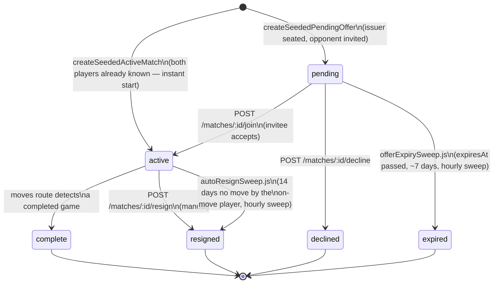
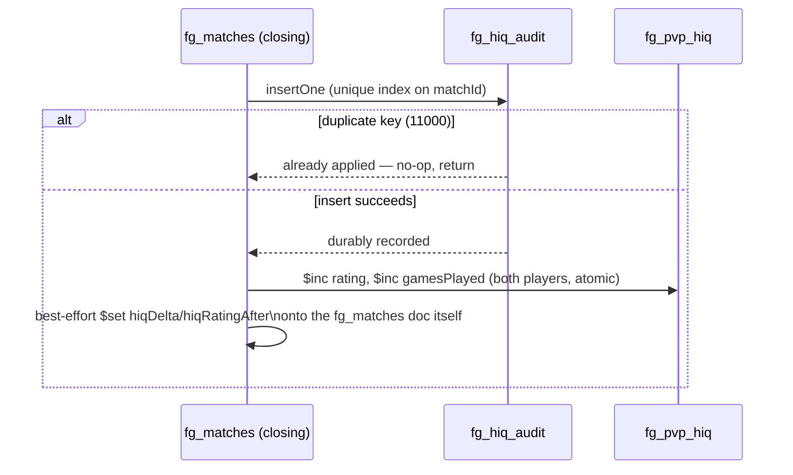

# Arcade Data Model — lifecycles, indexes, and the storage contract

**Purpose:** a handover-oriented companion to
[`../architecture/database-schema-free-game.md`](../architecture/database-schema-free-game.md),
which already documents every collection and field in full. That document answers "what is
stored, where, in what shape." This one answers the three things it deliberately doesn't cover:
**how a document moves through its states over time** (a game, a challenge, an invite, a
rating), **which indexes exist and why**, and **what the ADR-003 storage contract actually
constrains** for this database specifically. Written for a reader who has never seen "Number
Hive Arcade" (the free, pre-launch public game — `number-hive-newvis`) before.

**Everything here is cited to the actual route/lib source in `number-hive-newvis/backend/src/`**,
read directly on 2026-08-31 — no ODM/schema layer exists in this backend (raw MongoDB driver, see
the schema doc's own note on this), so there is no model file to cite instead of the code that
reads and writes each collection.

---

## 0. What "Arcade" means here, for context

Number Hive Arcade is the free, public-facing puzzle/strategy game (a Phaser 3 frontend,
Fastify backend) that funnels players toward Number Hive Education (the paid school product,
`number-hive-complete`). A player can use the Arcade anonymously (identified only by a
browser-local `clientId`) or register an account via Google OAuth. Anonymous or registered,
they can play solo against an AI, play an asynchronous turn-based match against another player,
or issue/accept a "seeded challenge" (a shareable, replayable puzzle for a friend to beat their
score on). All of this lives in one MongoDB database (`free_game`), entirely separate from
Education's `school_hive` database — see
[`../architecture/system-overview.md`](../architecture/system-overview.md) for why the two are
kept apart.

---

## 1. Document lifecycles

### 1.1 Match lifecycle (`fg_matches`) — asynchronous PvP

A match document is created in one of several ways and then moves through a small set of
statuses. There is no single "create match" endpoint any more — the old bare cold-invite route
(`POST /matches`) was retired as dead code (CHG-3775, confirmed no live caller); every
current match is seeded by one of:

- **`createSeededActiveMatch`** (`backend/src/lib/gameCreation.js`) — both players already
  known (an existing connection redeeming a standing Play-Me link, or a queued redemption being
  promoted once a concurrency slot frees up). Match is created directly in status `active`, no
  lobby step.
- **`createSeededPendingOffer`** (same file) — only the issuer is seated; status `pending`,
  `connectionOfferFor` set to the invited opponent's `clientId`. Used for connections-roster
  "start a new game" and rematch offers.



**Who starts first** is not always the invitee: `computeStarter()`
(`backend/src/lib/gameLifecycle.js`) mechanically alternates which side moves first across a
given pair's game history (odd-numbered game for the pair → redeemer starts, even → the other
side), rather than always favouring one role. `createSeededPendingOffer` always seats the
eventual joiner as the first mover (player 2), matching the existing rematch-offer convention.

**`resignGame()`** (`gameLifecycle.js`) produces one identical closing-record shape
(`{status, resignReason, resignedBy, winnerClientId, closedAt}`) regardless of whether the
trigger is a manual resignation or the inactivity sweep — this is deliberate, so downstream
consumers (the head-to-head ledger, HIQ rating) never have to special-case which path closed the
game.

**Two sweeps enforce the time-based transitions**, both in-process `setInterval` jobs (no
distributed lock — justified in each file's header comment on the grounds this backend runs as a
single Fastify instance, per ADR-004):

| Sweep | File | Cadence | What it does |
|---|---|---|---|
| Auto-resign | `backend/src/lib/autoResignSweep.js` | Hourly (+ once at boot); 14-day inactivity threshold, both env-overridable | Finds `status:'active'` matches where the on-move player hasn't moved in 14 days (measured from `lastMoveAt`, or `createdAt` if no move was ever made) and resigns them against that player, via an atomic `findOneAndUpdate` CAS guard so a real move landing mid-sweep wins the race. Also triggers the same HIQ rating closure and queue-promotion side effects a manual resignation would. |
| Offer expiry | `backend/src/lib/offerExpirySweep.js` | Hourly (+ once at boot) | Finds `status:'pending'` offers past their `expiresAt` and transitions them to `status:'expired'` — replacing what used to be a silent physical TTL deletion that leaked the issuer's concurrency slot and never released a rematch claim. |

Both sweeps exist specifically because the collection's own MongoDB TTL index
(`{expiresAt:1}, {expireAfterSeconds:0}` — present only on `pending`/offer-style docs, not on
`active` matches, which deliberately omit `expiresAt` entirely so they're never silently deleted
by that index) would otherwise just delete the document with no closing record, no rating
resolution, and no freed concurrency slot.

### 1.2 Invite / connection lifecycle

Two different "invite" mechanisms exist and are easy to conflate:

- **Standing Play-Me links** (`fg_standing_links`) — one reusable, get-or-create link per
  issuing `clientId` (`backend/src/routes/links.js`), ~7-day TTL, cycled (not renewed in place)
  rather than ever having more than one live link per issuer. Redeeming one either starts a game
  immediately (`createSeededActiveMatch`, if the issuer has a free concurrency slot) or queues
  the redemption (below) if they don't.
- **Pending queue** (`fg_pending_games`) — a FIFO queue (`backend/src/lib/pendingGameQueue.js`)
  for redemptions that land while the issuer is already at their concurrency cap. No expiry in
  the current build ("a queued row waits indefinitely" — the code's own comment flags this as a
  deliberate spec assumption, not an oversight). `promoteQueueForPlayer()` is called from every
  match-closing path (moves-complete, manual resign, auto-resign) and pops at most one queued
  row per call, oldest first.

Once a link is redeemed, a **`fg_connections`** document (a symmetric, order-independent
"roster edge" between the two `clientId`s) is created — this is the durable relationship; the
link itself is just the one-time (or reusable) mechanism that established it. Connections can
subsequently be privately nicknamed (`fg_connection_nicknames`, directional — each side's label
for the other is independent), individually removed from one side's roster
(`fg_connection_removals`, directional tombstone), or severed via a block
(`fg_blocks`, which also forces a removal-tombstone side effect via `blockCheck.js`).

### 1.3 Challenge lifecycle (`fg_challenges`) — seeded solo-vs-AI, shared for comparison

A separate, simpler mechanism from matches — no turn-taking, no shared live state, just a
shareable seeded board plus a leaderboard of attempts:

```mermaid
stateDiagram-v2
    [*] --> created: POST /challenges\n(fresh or client-supplied board+AI seed pair)
    created --> created: POST /challenges/:id/attempts\n(any clientId, unlimited distinct attempters,\ncapped at 200 total attempts)
    created --> gone: TTL index deletes the doc\n(expiresAt, 7 days from creation —\nno sweep, no closing record;\n404 is indistinguishable from "never existed")
```

Notable: unlike matches, there is **no ownership/turn check** on submitting an attempt — any
`clientId` can attempt any known `challengeId`, since this is score comparison rather than
shared game state. The submitted score is checked for internal arithmetic consistency
(`game/challengeScoring.js`'s `validateScoreIntegrity`) but the scoring *formula* itself is
never recomputed server-side — the route explicitly does not duplicate the frontend's scoring
logic, only validates the shape of what it's given. This is a materially weaker integrity
guarantee than PvP HIQ (§1.4), which is deliberately never trusted from the client — worth
knowing if challenge leaderboards are ever surfaced competitively rather than just socially.

Expiry here has **no sweep and no closing record** — a straightforward MongoDB TTL deletion once
`expiresAt` passes, unlike the match-pending-offer case where a sweep was specifically added
(§1.1) because silent deletion caused real side-effect leaks. Challenges have no concurrency
slot or rematch claim to leak, so the plain TTL was left as-is.

### 1.4 Rating / audit event lifecycle (`fg_pvp_hiq`, `fg_hiq_audit`)

PvP HIQ (HiveIQ rating) is applied by exactly one shared function,
`applyPvpHiqOnClose()` (`backend/src/lib/hiqPvpClose.js`), called from every match-closing path
(moves-complete, manual resign, auto-inactivity resign) — deliberately never duplicated
per-trigger, so an auto-resigned game gets byte-identical rating treatment to a manual one (the
code frames this explicitly as closing a "go idle to dodge a rating hit" exploit).



**Idempotency is enforced by write order, not a lock:** the audit row is inserted *first*, and
only a successful insert (not a duplicate-key rejection) is allowed to proceed to mutate the
rating. This means `fg_hiq_audit` is the actual source of truth for "has this match's rating
been applied yet," not `fg_pvp_hiq` — a design choice made explicitly to avoid rewriting the
existing match-write path into a full optimistic-concurrency scheme.

**Rating mutation is commutative by design:** each player's rating is updated via atomic `$inc`
of a precomputed delta, never a read-then-overwrite `$set`. Two different matches closing for
the same player at nearly the same instant both still apply correctly (order-independent); the
only accepted imprecision is that each delta's expected-score/K-factor inputs were computed from
a rating snapshot that may be briefly stale — documented in the source as an explicitly accepted
simplification, not an oversight.

**This is server-side-only and deliberately separate from the single-player HIQ model** — PvP
results are never trusted from a client-submitted number (`routes/hiq.js`'s vs-AI scoring is a
different, client-computed system entirely, guarded only by a plausibility-bound check, not the
audit/idempotency machinery above).

---

## 2. Indexes — what exists and why

Full detail lives in `backend/src/db/indexes.js` (the single authoritative index-bootstrap
file — idempotent, re-run safely on every startup). Summarised here by purpose rather than
repeated field-by-field (see the schema doc's per-collection tables for field shapes):

| Purpose | Collections | Mechanism |
|---|---|---|
| Uniqueness / identity | `fg_visitors.clientId`, `fg_accounts.accountId`/`googleSub`/`emailHash`/`nickname`, `fg_matches.matchId`, `fg_challenges.challengeId`, `fg_standing_links.clientId`/`linkId`, `fg_connections.pairKey`, `fg_pvp_hiq.clientId`, `fg_hiq_audit.matchId`, `fg_push_subscriptions.endpoint`, `fg_game_snapshots.accountId` | Unique index — several are also the upsert key for their collection's get-or-create/update pattern |
| Directed-pair uniqueness | `fg_connection_nicknames`, `fg_connection_removals`, `fg_blocks` | Compound unique index on `(ownerClientId/blockerClientId, opponentClientId/blockedClientId)` — also the upsert/delete key each route uses |
| TTL auto-expiry | `fg_events` (90d), `fg_visitors` (90d **sliding**, keyed on `lastSeenAt` not `firstSeenAt`), `fg_matches` (absolute `expiresAt`, **pending offers only** — active/complete/resigned matches never carry this field), `fg_challenges` (absolute `expiresAt`, 7d), `fg_game_snapshots` (absolute `expiresAt`, 24h), `fg_standing_links` (absolute `expiresAt`, ~7d, reset only by cycle/revoke — never by redemption), `fg_system_events` (30d, hardcoded not env-configurable, since `expireAfterSeconds` can't be changed by re-running `createIndex`) | `expireAfterSeconds:0` on an absolute `Date` field (most collections), or a genuine rolling-window index (`fg_events`, `fg_visitors`, `fg_system_events`) |
| Query support | `fg_matches` (`players.clientId`+`status` for "my active matches"; `status`+`lastMoveAt` specifically added, CHG-3764, to support the auto-resign sweep's query; `connectionOfferFor`+`status` added, CHG-3771, for the incoming-offer lookup) | Compound, purpose-built per named call site — each is commented in-source with the exact query it exists for, not added speculatively |
| Reverse-direction lookups | `fg_connections.clientIdA`/`clientIdB` (both indexed separately — `pairKey` alone can't serve "all connections touching X" from either side), `fg_blocks.blockedClientId` (supports `isBlocked()`'s bidirectional `$or` query) | Separate single-field indexes alongside the primary compound/unique index |
| Attribution/analytics | `fg_visitors.utmSource+utmCampaign`, `fg_visitors.country`, `fg_visitors.firstSeenAt`, `fg_events.eventName+ts`, `fg_events.sessionId` | Query-pattern-driven, not exhaustive |

**`fg_pending_games`** is the one queue-like collection with **no TTL at all** — indexed only on
`(issuerClientId, queuedAt)` for FIFO pop order. This is a stated spec assumption (a queued
redemption waits indefinitely for a concurrency slot to free up), not an omission.

---

## 3. The ADR-003 storage contract, as it applies to this database

[`number-hive-complete/docs/adr/003-migration-safety.md`](https://github.com/NumberHive/number-hive-complete/blob/main/docs/adr/003-migration-safety.md)
is the cross-repo migration-safety ADR (see
[`../architecture/system-overview.md`](../architecture/system-overview.md) for which ADRs govern
which repo boundaries). It is not just a paper policy for the Arcade side — **the current
`number-hive-newvis` code cites it directly**: `backend/src/routes/challenges.js`'s file header
explicitly notes that the new challenge feature was built as a wholly separate route
family/collection specifically so that `routes/matches.js`/`fg_matches` "are left completely
untouched (ADR-003 Rule 4: existing `?match=` links must keep resolving for their 7-day TTL)."

The rules with a direct, checkable footprint in this database's collections:

| ADR-003 rule | What it constrains | Where it shows up in `free_game` |
|---|---|---|
| Rule 1 — localStorage keys frozen | `anon_client_id`, `anon_session_id`, `buzz_profile`, `game_snapshot`, `fg_nickname`, `hiq_profile` | Client-side only, not a MongoDB concern directly, but `anon_client_id` is the `clientId` every collection in this database joins on — renaming it client-side without a migration script would sever every server-side record from the player who generated it. |
| Rule 4 — old challenge/match URLs must resolve | `?match=<id>` links already shared into the wild | `fg_matches` — the reason cold-invite creation could be retired as dead code (CHG-3775) without breaking any *existing* shared link: existing `matchId`s still resolve via `GET`/`join`, only the *creation* route changed. Also the reason `fg_challenges` was built as a **new, separate** collection/route family entirely, per the challenges.js citation above, rather than folding challenge behaviour into `fg_matches`. |
| Rule 5 — push subscriptions survive backend changes | VAPID keypair stability, `fg_push_subscriptions` migrated not dropped | `fg_push_subscriptions` — keyed by `clientId`, not `accountId`, specifically so it keeps working for anonymous players across any backend change. |
| Rule 7 — no shared database writes during transition | The free-game backend must not write to any collection `number-hive-complete` also writes to | Consistent with the two-database separation this whole document assumes (`free_game` vs. `school_hive`) — no evidence of any cross-write found in the routes/lib reviewed for this document or the earlier schema doc. |

**Not independently re-verified for this document:** whether Rule 1's frozen localStorage keys
are still honoured exactly as listed in the ADR — that's a frontend/client-code question, out of
scope for a database document. Flagged here only so it isn't assumed covered.

---

## 4. Decimal128 — confirmed absent from the Arcade side

`number-hive-complete`'s Stripe billing data uses MongoDB's `Decimal128` type (a known
migration-safety concern for that repo — see `open-items.md` for the production-data angle).
**Searched directly for the same pattern in `number-hive-newvis`:** no match for `Decimal128`
anywhere in `backend/src/` or `docs/` (checked 2026-08-31, whole-repo grep excluding
`node_modules`). Arcade has no billing/money concept of its own — this is a confirmed negative
finding, not an inference, and it means none of the `fg_*` collections carry the numeric-type
migration risk that applies to Education's subscription/billing data.

---

## 5. What this document does not cover

- **Field-level shape of every collection** — see
  [`../architecture/database-schema-free-game.md`](../architecture/database-schema-free-game.md),
  which this document deliberately does not duplicate.
- **The full `eventName`→`props` analytics taxonomy** — covered in the pending
  `handover/analytics-inventory.md` (next in this handover's build order), not here.
- **Concurrency-cap value and enforcement mechanics beyond what's needed to explain the queue
  lifecycle in §1.2** — the concurrency cap itself (`backend/src/lib/concurrencyCap.js`),
  the queue-on-cap invite flow in full, guest-vs-account behaviour, and "Your Turn" surfacing
  belong in the pending `handover/async-arcade-architecture.md`, which will cross-link back here
  for the data side rather than repeat it.
- **Whether ADR-003 Rule 1's frozen localStorage keys are still honoured in current frontend
  code** — noted as out of scope in §3, not verified here.

---

*Compiled 2026-08-31 by direct inspection of `number-hive-newvis/backend/src/lib/gameLifecycle.js`,
`gameCreation.js`, `hiqPvpClose.js`, `pendingGameQueue.js`, `autoResignSweep.js`,
`offerExpirySweep.js`, `routes/challenges.js`, `db/indexes.js`, and
`number-hive-complete/docs/adr/003-migration-safety.md`; cross-checked against
`architecture/database-schema-free-game.md` (2026-08-28) for consistency — no contradictions
found, this document is additive lifecycle/index/contract detail behind that document's
entity/field reference.*
